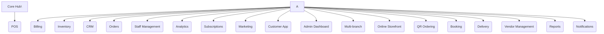
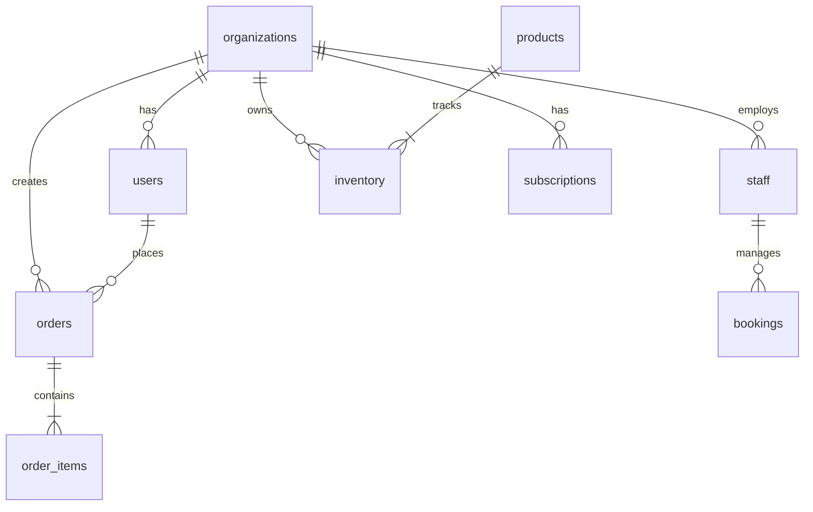

# Modular All-in-One Business OS (MABOS)

---

## 1\. Product Vision

### Product Overview

A fully modular, scalable SaaS platform empowering diverse businesses—ranging from restaurants to fitness centers—to digitally operate, customize, and scale with maximum flexibility from a single, unified interface.

### Mission Statement

Democratize digital transformation by offering a plug-and-play, no-fuss operating system for all SMBs, tailored to their unique sector needs, with zero code or heavy IT overhead.

### Long-term Vision

Become the “OS for SMBs”—the leading digital operating system for millions of businesses globally, enabling effortless management across all operational, customer-facing, and analytical functions.

### Core Philosophy

* Modular plug-n-play
* Unified design language
* Extreme real-world usability
* Minimize operational complexity
* Build once, deploy everywhere

### Market Gap

Current market solutions are category-specific, inflexible, or require heavy custom development. There’s no platform combining true modularity, scalability, and ease for all SMB categories, from hospitality to retail and services.

---

## 2\. Problem Statement

### Problems Faced by SMBs

* Disjointed operational processes
* Separate tools for POS, inventory, CRM, etc.
* High setup/maintenance costs
* No single dashboard for all needs

### Problems with Existing Platforms

* Category-locked (food, retail, salon-only, etc.)
* Vendor lock-in with poor integration
* Lack of real modularity

### Why Current Systems Are Fragmented

* Industry-specific codebases
* Closed architectures
* Siloed data, double-entry

### Pain Points in Customization

* Business context changes = custom dev needed
* Out-of-box solutions too rigid

### Operational Inefficiencies

* Inefficient staff, inventory, and order management
* Inconsistent analytics and reporting
* Manual, error-prone operations

---

## 3\. Business Opportunity

|  | Value |
| --- | --- |
| TAM | $50B+ global SMB SaaS |
| SAM | $5–10B (modernizing digitally-active SMBs in initial regions) |
| SOM | $500M (early-adopter regions, \~1% of TAM) |

### SaaS Opportunity

* Subscription-based recurring revenue
* Add-on/commission/enterprise upsell

### Market Trends

* Rapid post-pandemic digital adoption
* Offline-to-online transformationjj
* Demand for unified solutions among SMBs

### Why Now

* Modern cloud and UI tech make modular all-in-one a reality
* Low/no-code market signals demand simplicity

### Competitive Landscape

* Petpooja, Toast, Shopify, Square, Mindbody (vertical focus)
* No cross-vertical, unified, ultra-flexible OS for SMBs

### Positioning Strategy

* Universal, business-type agnostic platform
* Modular, flexible, and self-serve onboarding
* Unified pricing and experience

---

## 4\. User Personas

| Persona | Goals | Pain Points |
| --- | --- | --- |
| Restaurant Owner | Streamlined orders, CRM | Juggling multiple apps |
| Retail Shop Owner | Inventory, multi-branch | Manual tracking |
| Salon Owner | Bookings, staff scheduling | Custom bookings/system |
| Gym Owner | Membership, attendance | Fragmented solutions |
| Multi-branch Operator | View/manage all branches | No unified overview |
| Store Manager | Daily operations, reporting | Double-entry, errors |
| Cashier/Staff | Fast order handling, minimal training | Complex UIs, slow POS |
| Delivery Manager | Assign/manage orders, track drivers | Siloed logistics |
| Customer/End User | Fast checkout, loyalty | Poor experience, long waits |

---

## 5\. Core Product Architecture

### Modular Architecture

* **Core Hub (Kernel):** Handles multi-tenancy, authentication, settings
* **Feature Modules:**
  * POS, Billing, Inventory, CRM, Orders, Staff Management, Analytics, Marketing, Subscriptions, Customer App, Admin, Multi-branch, Online Storefront, QR Ordering, Booking, Delivery, Vendor Management, Reports, Notifications

Module Relationships Diagram



Shared Data Architecture

* All module data flows through a common data API/bus
* Tenancy: strict data isolation using RLS (Row-Level Security)
* Module enable/disable via feature flags per tenant

---

## 6\. User Flows

### 1\. Business Onboarding

* Visit landing page → Signup flow (email, phone, Google/Apple) → Enter business info → Guided setup wizard

### 2\. Subscription Purchase

* Post-signup → Module/pricing selection → Payment gateway (Stripe/Razorpay) → Instant access

### 3\. Store Setup

* Basic profile → Choose modules → Configure POS/menu/inventory → Brand settings, staff invite

### 4\. Module Selection

* Access dashboard → Choose/enable modules → Configure settings per module

### 5\. Product Setup

* Add categories/products/services, pricing, availability

### 6\. Staff Creation

* Create roles, invite via email/SMS/app, set permissions

### 7\. Customer Ordering

* Order via POS, web store, or QR → Real-time sync across devices

### 8\. Billing

* POS, online checkout, invoice generation, multiple payment modes

### 9\. Analytics Tracking

* Dashboard: sales, inventory, staff, and customer insights per branch/module

### 10\. Multi-branch Management

* Branch switcher; global vs. branch-specific actions and analytics

---

## 7\. Functional Requirements

* **Authentication:** Email, phone, social logins, JWT, OAuth2
* **Authorization:** RBAC (roles: Owner, Manager, Staff, Customer)
* **Role Management:** Customizable per business
* **Inventory:** Track, restock, low-stock alerts, per-branch inventory
* **Orders:** POS orders, online orders, statuses, fulfillment, returns
* **POS:** Fast register, split payments, receipt printing, barcode/QR
* **Payments:** Stripe/Razorpay, card/cash, refunds, settlement dashboard
* **Notifications:** Email (Postmark), SMS, in-app (Supabase Realtime); FCM/Web Push deferred to Phase 2
* **Realtime Sync:** Supabase realtime—orders, stock, dashboard sync
* **Reports:** Exportable (CSV, PDF), scheduled reports
* **CRM:** Customer profiles, segmentation, activity timeline
* **Booking:** Service businesses calendar, reminders
* **QR Systems:** Customer-generated QR codes for menus/orders
* **Customer App:** PWA/mobile, self-checkout, loyalty points
* **Admin Controls:** Tenant management, usage reporting, module toggling

---

## 8\. Non-Functional Requirements

* **Performance Targets:** P99 < 400ms for API; UI load < 2s
* **Scalability Goals:** 10k tenants, 100k+ daily active users (MVP); globally scalable
* **Uptime:** 99.95% SLO
* **Security:** RLS, bcrypt/SRP password, 2FA, JWT expiry, least privilege
* **GDPR:** Right to data erasure, export, clear consent
* **Encryption:** TLS (in transit), AES-256 (at rest)
* **Mobile:** 100% responsive, PWA support
* **Backups:** Daily encrypted backups, point-in-time recovery
* **Disaster Recovery:** RPO < 1hr, automated failover
* **Monitoring/Logging:** Structured logging, alerting (Sentry/Datadog)

---

## 9\. Technical Architecture

### Primary Stack Justification

* **Frontend/Backend:** Next.js (fullstack, API routes, SSR, React for UI)
* **Database:** PostgreSQL (cloud-managed, mature, scalable)
* **ORM:** None (Direct Supabase Client `@supabase/ssr` for native RLS and type-safety)
* **Authentication:** Supabase Auth (JWT/OAuth/initiate SSO later)
* **Realtime/Subscriptions:** Supabase realtime, websockets, notifications
* **Storage:** Supabase storage (files/images)
* **Hosting:** Vercel (serverless, edge, CDN cached)
* **Deployment:** GitHub Actions CI/CD → Vercel
* **Admin Dashboard:** Built into Next.js app
* **Notifications:** Firebase Cloud Messaging, email via Postmark
* **Analytics:** Supabase, Vercel Analytics, custom events
* **Payments:** Stripe (global) | Razorpay (India+)
* **Multi-tenancy:** Row-level security in Postgres/Supabase

Stack Rationale

* **One primary tech ecosystem (Supabase + Next.js + Vercel + Stripe) for extreme build velocity and zero ops friction.**
* **No Prisma or separate ORM overhead:** Direct Supabase client calls ensure Native RLS is automatically applied, removing security risks and sync lags.
* Full TypeScript stack from database types to React components.
* Serverless and edge capabilities for minimum infrastructure management.

| Area | Tech | Notes |
| --- | --- | --- |
| Frontend | Next.js + React | SSR, SSG, CSR, API routes & Server Actions |
| Backend | Next.js API Routes | Module-based REST, direct Supabase Server Client integrations |
| Styling | Tailwind CSS | Utility-first; consistent design tokens |
| Component Library | shadcn/ui (Radix + Tailwind) | Accessible, copy-paste components for SaaS UI |
| Database | PostgreSQL | Managed by Supabase (relational, scalable) |
| Client / SDK | Supabase Client (`@supabase/ssr`) | Unified database access with native Row-Level Security (RLS) enforcement |
| Auth | Supabase Auth | JWT/OAuth; single source of truth for identity |
| Storage | Supabase Storage | File/image/user asset storage |
| Realtime | Supabase Realtime | Orders, inventory sync, in-app notifications |
| Payments | Stripe + Razorpay | Global (Stripe) + India (Razorpay); webhook-driven |
| Hosting | Vercel | Global Next.js edge hosting |
| Analytics (Traffic) | Vercel Analytics | Web vitals and page views only |
| Analytics (Business) | Postgres / Supabase | Custom event tables: revenue, orders, usage |
| Notifications (Email) | Postmark | Transactional email |
| Notifications (In-app) | Supabase Realtime | MVP-ready, no extra infra |
| Notifications (Push) | FCM / Web Push | Deferred to Phase 2 |
| CI/CD | GitHub Actions | Lint, test, preview builds, deploy |
| Monitoring | Sentry | Error tracking and logging |
| Background Queues | Supabase Edge Functions | Lightweight serverless jobs for async processes (invoices, syncs) |
| Cache (optional) | Redis | Phase 2 — high-throughput modules only |

Alternatives Considered

| Alternative | Rejected Because |
| --- | --- |
| Firebase | Data model constraints, rigid rules |
| MongoDB | Joins, reporting, RBAC challenges |
| Microservices | Overhead, MVP timeline risk |
| AWS Amplify | Vendor lock-in, complexity, cost |

Folder Structure Sample

```shell
/
 ├─ app/          // Next.js App Router (Frontend pages & API routes)
 ├─ components/   // Reusable UI components (shadcn/ui)
 ├─ lib/          // Shared utilities & generated Supabase types
 ├─ supabase/     // Migrations, seed scripts, & Edge Functions
 └─ docs/         // System design & API specifications
```

API Structure

* RESTful routes and Server Actions via Next.js
* JWT-based authentication validated natively via `@supabase/ssr` middleware
* Direct type-safe data access using automatically generated database types

Database & Data Flow

* Postgres schemas per tenant (RLS enforced)
* Tables: users, orgs, products, orders, inventory, bookings, staff, etc.

Realtime & Caching

* Supabase (orders/stock, bookings, push updates)
* Redis (optional, later for high-throughput modules)

Queue Handling

* For heavy jobs (invoicing, exports): use Supabase Functions/Edge

Deployment & CI/CD

* Vercel for all apps
* GitHub Actions for tests/lint/preview builds
* Environment-based deployments (dev, staging, prod)

---

## 10\. Database Design

### Multi-Tenant Schema Strategy

* Single DB, RLS isolation by org/tenant

Core Entities

* users, organizations, products, categories, orders, order_items, inventory, staff, bookings, modules, subscriptions, notifications

Sample Relationship Diagram



RBAC Structure

* users ⟶ roles (Owner, Manager, Staff, Customer)
* org_roles table maps users to role per organization

Example Schemas

* users: id, email, name, image_url, created_at, updated_at (mirrored from Supabase Auth)
* org_roles (userbase authorization): id, org_id, user_id, role, status, joined_at
* inventory: id, org_id, product_id, qty_on_hand, threshold, location, updated_at
* orders: id, org_id, customer_id, staff_id, status, total, created_at
* staff: id, org_id, name, email, phone, role, status
* subscriptions: id, org_id, stripe_id, plan, status, renewal, started_at

---

## 11\. UI/UX System

### Design Philosophy

* Modern, clean, high-contrast, minimal distraction
* Mobile-first, intuitive navigation

### SaaS Dashboard Design

* Modular cards/widgets
* Collapsible navigation
* Quick actions on each page

### Mobile-first/Responsive

* Tailwind CSS for utility-first, atomic classes
* Responsive grid & component library
* PWA support

### Accessibility

* Focus indicators, ARIA attributes, color contrast, keyboard navigation

### Theme System

* Dark/light themes; brand accent colors per tenant

### Component Strategy

* **shadcn/ui** (Radix UI + Tailwind CSS) as the primary component library; atomic design principles; copy-paste components ensure no runtime dependency overhead

### Dashboard Layout

* Sidebar for navigation
* Topbar for notifications/account
* Main pane: dynamic widgets/modular panels

### Navigation System

* Multi-branch switcher
* Search bar omnipresent
* Breadcrumbs for nested modules

---

## 12\. MVP Scope (2 Months)

### MVP Features

* Multi-tenant onboarding
* Module enable/disable (feature flags)
* POS module (basic)
* Products/services/inventory management
* Orders (physical & online)
* Staff invite & role management
* Customer basic profiles
* Subscriptions/billing via Stripe
* Analytics/dashboards (sales, inventory)
* Notifications (in-app, email)
* Responsive/mobile dashboard

### Features Postponed

* Loyalty programs, advanced CRM, marketplace, franchise, white-label

### Sprint Breakdown & Roadmap

| Sprint | Focus | Deliverables |
| --- | --- | --- |
| 1 | Core infra/onboarding | Auth, orgs, module toggling |
| 2 | Data schemas, POS prototype | Products, categories, basic orders |
| 3 | Inventory, staff, roles | Inventory, role mgmt, staff CRUD |
| 4 | Payments/Stripe integration | Payment flow, subscription start/renewal |
| 5 | Online ordering/QRC/PWA shell | Web store, QR scan, mobile checks |
| 6 | Analytics, notifications | Sales/inventory dashboards, email/in-app |
| 7 | Polish, error states, backups | UX fixes, backup/recovery, accessibility |
| 8 | Final QA, docs, go-live | Landing, setup wizard, docs, QA |

### Team Structure

* 2–4 fullstack devs (Next.js/TS)
* 1 UI/UX designer
* 1 PM/founder

### Priority Matrix

* Must-have: Onboarding, POS, inventory, staff, orders, payments, dashboards
* Nice-to-have (post-launch): Loyalty, advanced CRM, vendor/booking modules

### Engineering Timeline

* Week 1–2: Infra/Auth/Org/Modules
* Week 3–4: POS/Inventory/Staff/Orders
* Week 5: Payments/Online/QRC
* Week 6: Dashboards/Analytics
* Week 7: Polish/QA
* Week 8: Finalize/Launch

---

## 13\. Monetization Strategy

* **Pricing Tiers:**
  * Freemium: 1 module, 1 location, basic analytics
  * Starter: 3 modules, up to 2 locations, premium analytics
  * Growth: All modules, up to 5 locations, priority support
  * Enterprise: Unlimited, advanced features, white-label, SLA
* **Add-On Modules:** Booking, marketing, delivery management as paid add-ons
* **Enterprise Pricing:** Custom quotes, franchise/chain deals
* **Commission:** Small fee on payments via web store (optional)
* **Marketplace:** Future—3rd party modules/integrations

---

## 14\. Scalability Roadmap

| Phase | Focus |
| --- | --- |
| Phase 1 (Month 1) | MVP, core modules, 100 tenants |
| Phase 2 (Month 2) | Loyalty, booking, vendor, 1000+ tenants, regional presence |
| Phase 3 (Month 3) | AI/predictive analytics, automation, open API, white-label, franchise, global expansion |

* **AI Integrations:** Automated inventory prediction, sales forecasting
* **Automation Roadmap:** Auto-restock, reminders, smart alerts
* **White-label:** Custom domains, branding
* **Franchise Support:** Branch template configs, region roles
* **Enterprise Expansion:** SSO, API, advanced SLA

---

## 15\. Risks & Challenges

* **Technical Risks:** Integration bugs, data isolation flaws, performance bottlenecks
* **Product Risks:** Poor initial fit (too generic), lack of vertical depth
* **Operational Risks:** Support, scaling onboarding, region compliance
* **Scaling Risks:** Tenant data clashes, noisy neighbor in multi-tenancy
* **Competition Risks:** Incumbents chasing modularity
* **Mitigations:**
  * Strict Postgres RLS, CI/CD tests
  * Early adopter feedback loop
  * MVP focus on horizontal value
  * Staged onboarding flows
  * Continuous monitoring and alerts

---

## 16\. Target Userbase

To support the MABOS commercial rollout and ensure high engagement on the consolidated Supabase + Next.js stack, the platform targets four major business segments that form our primary user base.

### 16.1 Target Segments & User Mix

| Business Vertical | Target Tenant Sub-types | Key Front-line Staff Users | End-Consumer Usage |
| --- | --- | --- | --- |
| **F&B / Hospitality** | Quick Service Restaurants (QSRs), Patisseries, Cafes, Salons | Cashiers, Waiters, Kitchen Chefs | Dine-in QR ordering, takeaway checkouts, feedback |
| **Retail & Commerce** | Boutiques, Specialty Stores, Groceries, Gift Shops | Cashiers, Inventory Clerks | Online storefront browsing, home delivery tracking |
| **Wellness & Services**| Salons, Spas, Consulting Centers, Clinics | Therapists, Receptionists | Direct booking, service schedule management, reviews |
| **Fitness & Gyms** | Local Gyms, Crossfit Boxes, Yoga Studios | Personal Trainers, Desk Admins | Class bookings, subscription renewals, check-ins |

### 16.2 User Base Projections (3-Month Growth Plan)

With the compressed 3-month scalability roadmap, MABOS targets aggressive user growth from launch to regional expansion.

| Projection Metric | Phase 1 (Month 1) | Phase 2 (Month 2) | Phase 3 (Month 3) |
| --- | --- | --- | --- |
| **Active Tenants** | 100 pilot outlets | 1,000 scaling outlets | 5,000 regional outlets |
| **Staff & Operator Users** | ~1,200 active users | ~12,000 active users | ~60,000 active users |
| **Active End-Consumers** | ~25,000 consumers | ~250,000 consumers | ~1,500,000 consumers |
| **Daily POS Transactions** | ~5,000 transactions/day | ~50,000 transactions/day | ~250,000 transactions/day |

### 16.3 Growth & Retention Channels

1. **Self-Serve Business Onboarding:** Extremely optimized 5-minute workspace setup wizard with predefined sector profiles (e.g. cafe templates with preloaded sample menus).
2. **Viral Consumer Loops:** Customer QR code ordering and digital receipt delivery automatically introduce MABOS to the local consumer base, driving consumer awareness and direct referrals.
3. **Multi-Location Hubs:** Single business operators invite managers and cashier staff, growing the internal business staff user base organically with zero acquisition cost.

---

## 17\. Final Recommendations

* **Architecture Decision:** Unified Next.js + Supabase + Stripe stack for extreme speed, 100% security coverage via native Row-Level Security, and single-source management.
* **MVP Strategy:** Focus purely on horizontal core value. Defer complex multi-app dependencies (like Prisma, Redis, or external job queue engines) to Phase 2 to ensure absolute deployment within 2 months.
* **Long-term Scaling:** Maintain a lean codebase with clean Postgres/Supabase foundations, adding edge features only as adoption dictates.
* **GTM:** Early partnerships, viral onboarding, target digital-forward SMBs, leverage mobile-first experience.

This structure, stack, and unified approach positions MABOS as a highly cohesive, blazing fast, and production-ready system capable of rapid development and immediate global scale.