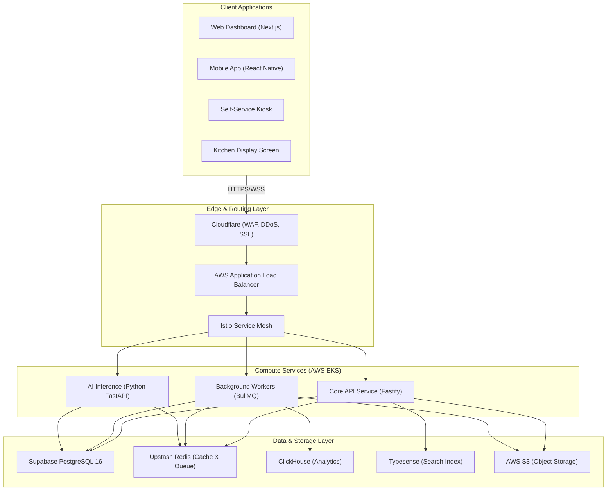
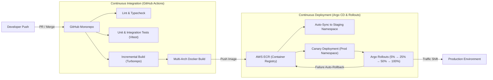
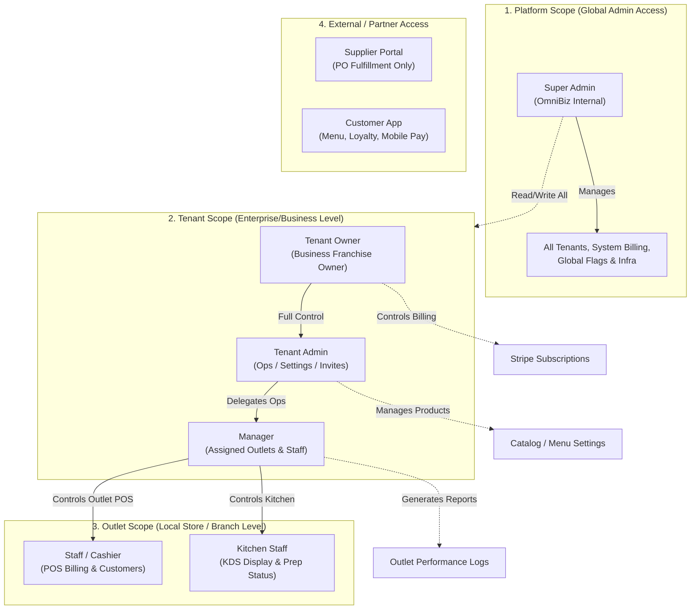
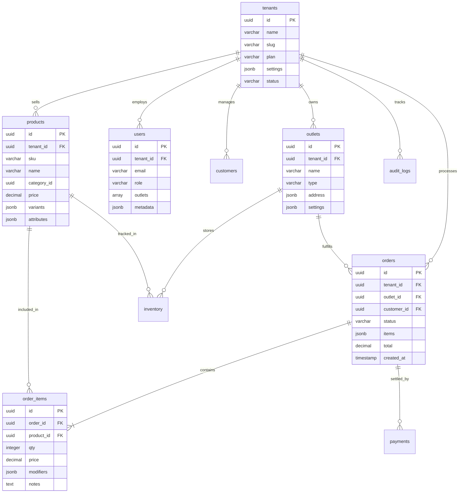
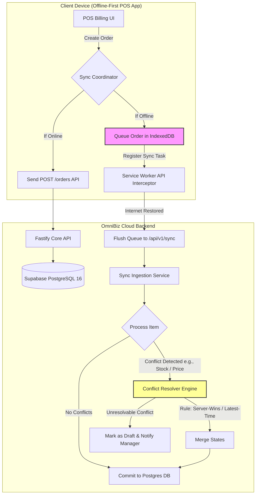
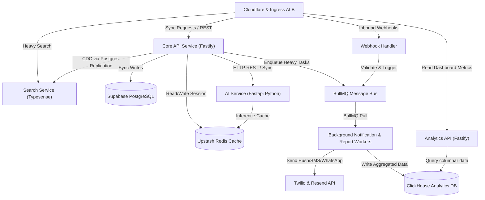
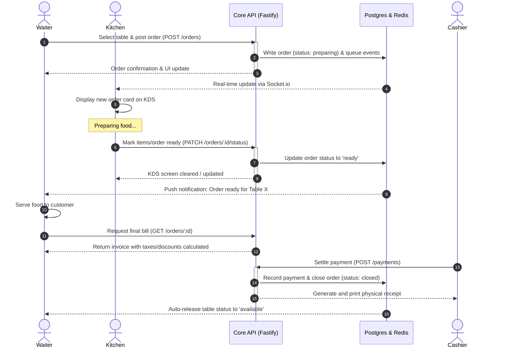
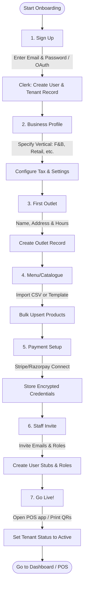

PRODUCT REQUIREMENTS DOCUMENT
OMNIBIZ PLATFORM
Universal Multi-Vertical Business OS
For Restaurants, Retail, Wholesale & Service Businesses
Version 1.0  |  Confidential
May 2026

# 1. Executive Summary
OmniBiz is a modular, AI-native, multi-tenant SaaS platform designed to serve as the complete operating system for businesses across restaurants, retail, wholesale, and service verticals. It consolidates point-of-sale (POS), order management, inventory, CRM, analytics, payments, loyalty, staff management, and supplier coordination into one deeply integrated platform with vertical-specific extensions.

The platform is built for the operator who runs a franchise, the entrepreneur who owns a chain of restaurants, and the wholesale distributor managing thousands of SKUs — without forcing them into a tool that was designed for someone else.

### Core Strategic Objectives
Replace 6–10 disconnected tools with one unified platform per business
Enable white-labeled resale to enterprise chains and franchise networks
Monetize AI inference, platform commissions, and premium module subscriptions
Scale to millions of end-users across thousands of business tenants globally
Maintain vertical-specific UX depth without sacrificing platform cohesion

### Target Verticals
| Vertical | Key Personas | Core Problems Solved |
| --- | --- | --- |
| Restaurant / F&B | Restaurant owner, F&B manager, kitchen staff, waiter | Table management, KOT flow, menu pricing, delivery aggregation |
| Retail | Store owner, floor manager, cashier | POS billing, barcode inventory, purchase orders, loyalty |
| Wholesale / Distribution | Distributor, warehouse manager, sales rep | Bulk orders, tiered pricing, credit management, route planning |
| Service Business | Salon owner, gym manager, clinic admin | Appointments, memberships, service packages, staff scheduling |

# 2. Product Vision & Goals
## 2.1 Vision Statement
"Give every business — from a single tea stall to a 500-outlet franchise — the operational intelligence of a Fortune 500 company."

## 2.2 Design Principles
| Principle | What It Means in Practice |
| --- | --- |
| Vertical-first depth | Restaurant mode looks and behaves differently than retail mode — not just a theme change |
| Mobile-native | Every feature must work on a 6-inch Android phone in a dim restaurant |
| Offline-first POS | Core billing must work without internet; sync when reconnected |
| AI-augmented, not AI-dependent | AI accelerates work but never blocks it; operators can always override |
| White-label ready | Every pixel can be rebranded; every domain can be custom |
| Composable modules | Businesses buy only what they need; modules plug in without code changes |

## 2.3 Success Metrics (Year 1–3)
| Metric | Year 1 Target | Year 3 Target |
| --- | --- | --- |
| Paying business tenants | 500 | 10,000+ |
| Monthly active end-users | 50,000 | 2,000,000+ |
| Gross transaction volume (GTV) | $10M | $500M+ |
| Net Revenue Retention | >95% | >120% |
| Platform uptime SLA | 99.9% | 99.99% |
| Time-to-onboard (new tenant) | <4 hours | <30 minutes (self-serve) |

# 3. Technology Stack
## 3.1 Frontend
| Layer | Technology | Rationale |
| --- | --- | --- |
| Web App Framework | Next.js 15 (App Router) | SSR/ISR for marketing pages, RSC for dashboard, file-based routing, Vercel-native |
| Mobile App | React Native (Expo SDK 52) | Shared business logic with web, large ecosystem, OTA updates via EAS |
| State Management | Zustand + React Query (TanStack) | Zustand for local UI state; React Query for server state, caching, and sync |
| Component Library | Custom design system (shadcn/ui base) | Fully owned, white-label friendly, Tailwind-powered |
| Drag & Drop Builder | dnd-kit + custom renderer | Lightweight, accessible, mobile-compatible |
| Offline Sync (POS) | IndexedDB + background sync service worker | Reliable offline billing; sync queue flushes on reconnect |
| Charts / Analytics | Recharts + custom SVG components | Lightweight, composable, theme-compatible |
| Internationalization | next-intl | Multi-language support from day one |

## 3.2 Backend
| Layer | Technology | Rationale |
| --- | --- | --- |
| API Layer | Node.js + Fastify (primary) | High-throughput, low-latency; Fastify outperforms Express 2–3x |
| Background Jobs | BullMQ + Redis | Queue-based workers for reports, notifications, sync, and AI tasks |
| Real-time | Socket.io + Redis pub/sub | Live KOT updates, order tracking, staff notifications |
| AI / ML | Python FastAPI microservice | Isolated inference; integrates OpenAI, Anthropic, local models |
| Search | Typesense (self-hosted) | Fast product/customer/order search; Elasticsearch alternative with lower ops cost |
| File Storage | AWS S3 + CloudFront CDN | Menu images, receipts, invoices, exports |
| Email / SMS | Resend (email) + Twilio (SMS) | Reliable delivery; Resend for transactional; Twilio for OTP and alerts |
| PDF Generation | Puppeteer (server-side) | Invoices, reports, KOT slips |

## 3.3 Database
| Layer | Technology | Rationale |
| --- | --- | --- |
| Primary Database | PostgreSQL 16 (via Supabase) | Row-level security, JSONB, full-text search, logical replication |
| ORM | Drizzle ORM | Type-safe, lightweight, migration-first; replaces Prisma for better perf |
| Cache Layer | Redis (Upstash for serverless) | Session storage, rate limiting, real-time pub/sub, queue backend |
| Analytics DB | ClickHouse (self-hosted) | Columnar store for billion-row event analytics; orders, page views, transactions |
| Vector Store | pgvector (Postgres extension) | AI embeddings for product search, recommendation, support |
| Search Index | Typesense | Synced from Postgres via CDC (change data capture) |

## 3.4 Mobile: React Native vs Flutter
| Dimension | React Native (Expo) | Flutter | Decision |
| --- | --- | --- | --- |
| Code sharing with web | ~70% shared logic via packages | Zero — Dart is separate | React Native wins |
| Performance | Good (JSI bridge); near-native | Excellent (Skia renderer) | Flutter slight edge |
| Dev ecosystem | Huge (npm) | Growing (pub.dev) | React Native wins |
| OTA updates | EAS Update (instant) | Shorebird (limited) | React Native wins |
| Hire-ability | Any React dev can contribute | Requires Dart expertise | React Native wins |
| Offline POS | IndexedDB via expo-sqlite | SQLite (excellent) | Tie |
| Verdict | RECOMMENDED | — | Use React Native |

Decision: React Native (Expo). The shared business logic with the Next.js web app, EAS OTA update capability, and far larger hiring pool make it the pragmatic choice for a SaaS company. The performance gap with Flutter is negligible for business applications.

# 4. Infrastructure Architecture
## 4.1 Cloud & Hosting Strategy

### System Architecture Overview

| Component | Provider | Configuration |
| --- | --- | --- |
| Web Frontend | Vercel | Next.js app; Edge middleware; global CDN; preview deployments per PR |
| API Services | AWS EKS (Kubernetes) | Auto-scaling node pools; separate pools for API, workers, AI service |
| Database | Supabase (managed Postgres) | Primary + read replicas per region; connection pooling via PgBouncer |
| Cache / Queue | Upstash Redis | Serverless Redis; global replication; used for sessions, BullMQ, pub/sub |
| Object Storage | AWS S3 + CloudFront | Multi-region buckets; signed URLs; CDN for images and exports |
| DNS / DDoS | Cloudflare | WAF, DDoS protection, rate limiting, custom domain SSL, Workers for edge auth |
| AI Inference | AWS SageMaker + Lambda | Heavy inference on SageMaker; lightweight classification on Lambda |
| Monitoring | Grafana + Prometheus + Loki | Metrics, logs, traces; alerting via PagerDuty |
| IaC | Terraform (Terragrunt) | All infra as code; separate state per environment; modules per service |

## 4.2 Kubernetes Architecture
All backend services run in AWS EKS. Cluster layout:
Namespace: production, staging, dev (isolated per environment)
Node pools: api-pool (c6i.xlarge), worker-pool (c6i.2xlarge), ai-pool (g4dn.xlarge for GPU), db-proxy-pool
HPA (Horizontal Pod Autoscaler) on API and worker deployments
Ingress: AWS ALB Controller + Nginx Ingress for internal routing
Secrets: AWS Secrets Manager mounted via External Secrets Operator
Service mesh: Istio for mutual TLS between services, traffic observability

## 4.3 CI/CD Pipeline

### Build, Test & Deployment Pipeline

| Stage | Tool | Action |
| --- | --- | --- |
| Source Control | GitHub (monorepo) | Branch protection; required PR reviews; signed commits |
| Lint & Type Check | GitHub Actions | ESLint, TypeScript check, Prettier on every push |
| Test | GitHub Actions + Vitest | Unit + integration tests; coverage threshold enforced |
| Build | Turborepo | Incremental builds; only changed packages rebuilt |
| Container Build | Docker + Buildx | Multi-arch images; layer caching via GitHub Actions cache |
| Registry | AWS ECR | Image tagging by git SHA; vulnerability scanning via Inspector |
| Deploy Staging | Argo CD | GitOps; auto-sync on merge to main |
| Deploy Production | Argo CD + Manual Gate | Canary via Argo Rollouts; 5%→25%→100% traffic shift |
| Rollback | Argo CD | One-click rollback to any previous git SHA |

## 4.4 Deployment Strategies
### Blue-Green Deployment
Maintained for major API version changes. Two identical production environments run simultaneously. Traffic switches at the load balancer level. Rollback is instantaneous — flip the switch. Used for: major schema migrations, breaking API changes, infrastructure upgrades.
### Canary Releases
Standard deployment for all feature releases. Argo Rollouts manages traffic splitting: 5% → 25% → 50% → 100% with automated analysis (error rate, p99 latency) gating each step. Automatic rollback triggers if error rate exceeds 1% or p99 latency exceeds 500ms.
### Feature Flags
All new features are shipped behind feature flags (LaunchDarkly). This decouples deploy from release. Flags are evaluated per-tenant, per-user, or by percentage rollout. Emergency kill switches for any feature without a deploy.

# 5. Authentication & Authorization
## 5.1 Auth Provider Comparison
| Dimension | Clerk | Auth0 | Supabase Auth |
| --- | --- | --- | --- |
| Setup speed | Fastest (UI components included) | Moderate | Fast |
| Multi-tenant orgs | Native (Organizations API) | Moderate setup required | Manual implementation |
| White-label | Limited on lower plans | Full on Enterprise | Full control (self-hosted) |
| Pricing at scale | Gets expensive ($0.02/MAU) | Expensive ($0.07/MAU enterprise) | Cheapest / included in Supabase |
| MFA support | TOTP, SMS, backup codes | Full (TOTP, SMS, push) | TOTP, SMS |
| Social OAuth | Full suite | Full suite | Full suite |
| Custom domain | Yes | Yes | Yes (self-hosted) |
| B2B features | Excellent | Good | Requires custom build |
| Verdict | Best for MVP speed | Best for Enterprise compliance | Best for cost at scale |

Recommendation: Start with Clerk for MVP (fast, excellent multi-tenant UX). Migrate or layer Supabase Auth for cost optimization post-PMF. Auth0 only if enterprise compliance (SOC2, HIPAA) requirements arrive early.

## 5.2 Multi-Role Authorization Model
Authorization is RBAC (Role-Based Access Control) with tenant-scoped roles.

### RBAC Hierarchy and Boundary Scoping

Permissions are evaluated at three levels:
| Level | Scope | Example |
| --- | --- | --- |
| Platform level | Anthropic/OmniBiz admin | Manage all tenants, billing, feature flags |
| Tenant level | Business owner and their team | Manage own store, staff, menu, reports |
| Outlet level | Specific branch staff | POS access only for Outlet 3 |

| Role | Access Level |
| --- | --- |
| Super Admin | Full platform access (OmniBiz internal) |
| Tenant Owner | All modules for their tenant; billing; staff management |
| Tenant Admin | All operational modules; cannot modify billing or owner settings |
| Manager | Assigned outlets; reports; staff scheduling; cannot access financials |
| Staff / Cashier | POS only; no access to reports or settings |
| Kitchen Staff | KDS view only; order status updates |
| Supplier | Limited portal: purchase order view and fulfillment only |
| Customer | Customer-facing app: orders, loyalty, profile |

## 5.3 OAuth & MFA
OAuth providers: Google, Apple, Facebook, Microsoft (configurable per tenant)
MFA: TOTP (Google Authenticator / Authy), SMS OTP, backup codes
Session management: short-lived JWTs (15min) + refresh tokens (30 days); device tracking
Staff PIN mode: quick re-auth for POS without full logout (4–6 digit PIN per session).

### 5.4 Shared Terminal POS Authentication Protocol
To accommodate high-throughput restaurant and retail environments where staff frequently share a single static terminal, we implement a custom dual-state session wrapper:
1. **Full Parent Session**: A manager or primary cashier registers the physical terminal initially by authenticating via Clerk (OAuth/JWT, which is persisted securely in local memory and lasts up to 30 days via a secure HttpOnly refresh token).
2. **Local Session Guard**: Once the parent session is authorized, the POS application interface triggers an overlay quick-PIN lock screen. Individual shift staff enter their assigned 4-to-6 digit PIN.
3. **Cryptographic Validation**: The PIN is hashed locally using a salt derived from the device metadata and checked against the local IndexedDB encrypted storage (synchronized periodically from the `/api/v1/users/pin-hashes` API which handles secure salted one-way hashing).
4. **Audit Trail Scoping**: All transactions completed during that active PIN lock window are automatically tagged with both the terminal's `parent_session_id` and the individual staff's `user_id` to guarantee fully accountable operational audit logs.

SSO: SAML 2.0 and OIDC support for enterprise tenants on Enterprise plan

# 6. Database Design
## 6.1 Multi-Tenant Schema Design
OmniBiz uses a shared-database, shared-schema multi-tenancy model with Row-Level Security (RLS) enforced at the PostgreSQL level. All tenant data lives in the same tables, isolated by a tenant_id foreign key and Postgres RLS policies.

| Pattern | Tradeoff | Decision |
| --- | --- | --- |
| Separate DB per tenant | Maximum isolation; extremely high ops cost | No — not viable at scale |
| Separate schema per tenant | Good isolation; schema management complexity | Optional for Enterprise plan only |
| Shared schema + RLS | Low cost; fast; RLS handles isolation at query level | Default for all tenants |

Core tenant isolation: every table includes tenant_id UUID NOT NULL with a Postgres RLS policy: CREATE POLICY tenant_isolation ON orders USING (tenant_id = current_setting('app.current_tenant')::uuid). The API sets this session variable via a Fastify plugin on every request after auth.

## 6.2 Core Schema (Simplified)

### Database Entity-Relationship Diagram (ERD)

| Table | Key Columns | Notes |
| --- | --- | --- |
| tenants | id, name, slug, plan, settings JSONB, status | Root entity; all others reference this |
| outlets | id, tenant_id, name, type, address, settings JSONB | Branch/location of a tenant |
| users | id, tenant_id, email, role, outlets UUID[], metadata JSONB | Staff and owner accounts |
| customers | id, tenant_id, phone, email, name, tags, loyalty_points, metadata JSONB | End customers; searchable |
| products | id, tenant_id, sku, name, category_id, price, variants JSONB, attributes JSONB | Menu items or retail products |
| orders | id, tenant_id, outlet_id, customer_id, status, items JSONB, total, created_at | Central transaction record |
| order_items | id, order_id, product_id, qty, price, modifiers JSONB, notes | Line items; modifiers as JSONB |
| inventory | id, tenant_id, outlet_id, product_id, qty, unit, low_stock_threshold | Per-outlet stock levels |
| payments | id, order_id, method, amount, gateway_ref, status, metadata JSONB | Payment records per order |
| audit_logs | id, tenant_id, user_id, action, entity_type, entity_id, before JSONB, after JSONB, ip, created_at | Immutable audit trail |

## 6.3 JSONB Usage Strategy
JSONB is used strategically for fields that are highly variable across tenants and verticals — not as a substitute for normalized schema where structure is known.
| Field | Example JSONB Content | Why JSONB |
| --- | --- | --- |
| tenants.settings | {"currency":"INR","timezone":"Asia/Kolkata","tax_enabled":true} | Varies per tenant; no fixed schema |
| products.variants | [{"name":"Large","price":250},{"name":"Small","price":180}] | Variable variant count |
| order_items.modifiers | [{"name":"Extra Cheese","price":30}] | Dynamic add-ons |
| customers.metadata | {"source":"zomato","allergies":["gluten"]} | Vertical-specific extra fields |
| audit_logs.before/after | Full snapshot of changed record | Point-in-time state capture |

## 6.4 Soft Deletes, Versioning & Audit Logs
### Soft Deletes
All business entities use soft delete: deleted_at TIMESTAMP (NULL = active). RLS policies filter out soft-deleted rows by default. Hard deletes only for GDPR erasure requests (via a scheduled job with double-confirmation).
### Versioning
Products and menus use an explicit versioning table: product_versions (id, product_id, version_number, data JSONB, published_at, published_by). Historical orders reference the version snapshot embedded in order_items.modifiers to preserve pricing accuracy.
### Audit Logs
The audit_logs table is append-only. A Postgres trigger on key tables (products, orders, users, pricing) fires on INSERT/UPDATE/DELETE and writes a row capturing: who, what action, entity type + ID, before/after JSONB snapshots, IP address, timestamp. No RLS policy blocks reads for tenant owners — they can always view their audit trail.
### Activity Streams
A lightweight activity_feed table stores denormalized feed events (actor, verb, object, target, metadata JSONB). Used for the dashboard activity ticker and notification center. Populated by background workers listening to the event bus.
### Event Sourcing
Full event sourcing is not implemented at MVP. However, all state-changing operations emit domain events to a Redis stream (XADD) consumed by workers. This provides an event log suitable for eventual migration to full event sourcing for the orders and inventory bounded contexts in V3.

# 7. Payments Architecture
## 7.1 Payment Gateway Strategy
| Gateway | Use Case | Markets | Commission |
| --- | --- | --- | --- |
| Stripe | International cards, subscriptions, Connect | US, EU, Global SaaS billing | 2.9% + $0.30 |
| Razorpay | UPI, Indian cards, BNPL, QR codes | India primary market | 2% + GST |
| PayPal | B2B invoices, international buyers | Global enterprise invoicing | 3.49% + fixed |

Architecture: A payment abstraction layer (PaymentService) sits in front of all gateways. The tenant's preferred gateway is configured per-outlet. The abstraction exposes a unified interface: createCharge(), refund(), createSubscription(), webhookHandler(). Adding a new gateway requires only implementing this interface — zero changes to order flow.

## 7.2 Subscription Billing
| Plan | Billing Model | Features |
| --- | --- | --- |
| Starter | $29/month per outlet | POS, basic inventory, 1 user |
| Growth | $79/month per outlet | All core modules, 10 users, analytics |
| Pro | $199/month per outlet | All modules, unlimited users, AI features, API access |
| Enterprise | Custom annual contract | White-label, SLA, dedicated support, custom integrations |

Billing engine: Stripe Billing for all plan subscriptions. Usage-based billing (AI tokens, SMS, API calls beyond quota) metered via Stripe Meters. Razorpay Subscriptions used for Indian tenants paying in INR. Annual plans discounted 20%; monthly plans on credit card or UPI autopay.

# 8. UI/UX Requirements
## 8.1 Design System
OmniBiz ships a proprietary design system (OmniBiz UI) built on top of shadcn/ui primitives with Tailwind CSS. The design system is published as an internal npm package in the monorepo and consumed by all apps (web, mobile, customer app, admin panel).
| Token Category | Examples |
| --- | --- |
| Color primitives | neutral-50 → neutral-950, brand-50 → brand-900, semantic: success, warning, error, info |
| Typography | Display / H1-H4 / Body-L/M/S / Caption / Label; weight scale: 400, 500, 600, 700 |
| Spacing | 4px base unit; scale: 4, 8, 12, 16, 24, 32, 48, 64, 96px |
| Shadows | sm / md / lg / xl; color-aware (brand-tinted on focus) |
| Border radius | 4px (inputs), 8px (cards), 12px (modals), 16px (panels), 9999px (pills) |
| Motion | Duration: 100ms (micro), 200ms (default), 350ms (page); easing: ease-out for entrances |

## 8.2 Dark / Light Mode & Theme Engine
All color tokens are CSS custom properties (variables). Light and dark themes are defined as separate token sets. The theme is applied via a data-theme attribute on the root element, toggled by user preference and system setting. The theme engine supports:
System default (auto-switches with OS)
User override (stored in user preferences)
Tenant-level default (tenant sets default for their staff app)
White-label override (enterprise tenants inject their brand color palette as CSS vars)

## 8.3 White-Labeling
| Customization Layer | What Can Be Overridden |
| --- | --- |
| Brand colors | Primary, secondary, accent, background, surface tokens |
| Logo | SVG logo in header, login screen, receipts, emails |
| Domain | Custom domain (app.yourbrand.com) via Cloudflare CNAME + SSL |
| Email templates | All transactional emails use tenant logo and colors |
| App name | Shown in page titles, mobile app store listings (for enterprise) |
| Login screen | Custom hero image, tagline, brand name |
| Receipt / invoice | Custom header, footer, color, font, legal text |

## 8.4 Drag-and-Drop Builder
The drag-and-drop builder is used for: digital menu layout, customer-facing kiosk screens, loyalty campaign banners, and dashboard widget arrangement. Built with dnd-kit for accessibility compliance. Components are defined as a registry of blocks (ImageBlock, TextBlock, ProductGridBlock, BannerBlock). A JSON schema represents the layout; the renderer hydrates it at runtime. Enterprise tenants can inject custom blocks via the app marketplace.

## 8.5 Responsive Layout Strategy
| Breakpoint | Target Device | Layout Behavior |
| --- | --- | --- |
| < 640px (mobile) | Android POS, staff phone | Single column; bottom navigation; full-screen modals |
| 640–1024px (tablet) | iPad POS, manager tablet | Two-column split; sidebar navigation collapses |
| 1024–1440px (desktop) | Manager workstation | Full sidebar; multi-panel dashboard |
| > 1440px (ultrawide) | Analytics display, wall screen | Wide data tables; multi-column analytics |

# 9. Scalability Architecture
## 9.1 Design for Scale

### Offline POS Sync Architecture

### 9.1.1 Local-First Sync & Conflict Resolution Rules
To maintain the high performance of a native local-first app without suffering data corruption, the system enforces a strict deterministic conflict resolution protocol during background sync playbacks:
- **Deduplication Safeguard**: All actions, transactions, and order edits are stamped with a client-side generated cryptographically strong UUID (`id`) and a monotonic sequence counter. This guarantees the API server can completely filter out duplicate sync frames using a 24-hour deduplication window (Redis cached).
- **Inventory Exhaustion Conflicts**: If an item is sold offline but runs out of stock in the cloud database before the local device syncs, the order is still **accepted** to preserve the physical retail/F&B sale. The transaction is committed, but the corresponding product stock level goes negative in `inventory`, and a high-priority "Stock Level Exception" is emitted to the manager's dashboard via the activity feed.
- **Pricing & Modification Clashes**: If a product price is updated in the cloud while a waiter is offline booking orders at the old price, the server honors the checkout price recorded locally on the device at the exact `created_at` timestamp. The server flags the price deviation in `payments.metadata` and records it as an automatic adjustment.
- **Concurrent Order Modification**: If two waiters edit the same order simultaneously (e.g., Table 4 adding dessert from two different tablets), the server merges the items based on their unique `order_items.id` and modifier payload, accumulating the total sum. If they change the same item (e.g. quantity of water bottles), the larger sequence counter or the latest timestamp wins.

| Challenge | Solution |
| --- | --- |
| Millions of concurrent users | Stateless API pods; horizontal scaling via K8s HPA; CDN for static assets |
| Thousands of tenants | RLS isolation; connection pooling (PgBouncer); tenant-aware caching in Redis |
| High concurrency POS | Optimistic UI updates; write-through cache; idempotent order creation (UUID keys) |
| Real-time KOT / orders | Socket.io rooms per outlet; Redis pub/sub as message broker; fan-out via workers |
| Global deployment | Vercel Edge Network (frontend); multi-region Postgres read replicas; Cloudflare CDN |
| Offline POS sync | Local-first architecture: IndexedDB queue; service worker intercepts API calls; sync on reconnect |
| Report generation at scale | Async: user triggers report → BullMQ job → ClickHouse query → S3 upload → notify via WS/email |

## 9.2 Caching Strategy
| Data Type | Cache Layer | TTL |
| --- | --- | --- |
| Tenant settings / config | Redis (app-level) | 10 minutes; invalidated on change |
| Product / menu catalogue | Redis + CDN edge cache | 5 minutes; invalidated on publish |
| User session | Redis | 30 days (sliding) |
| Dashboard metrics | Redis | 1 minute; background refresh |
| AI inference results | Redis | 24 hours; keyed by input hash |
| Static assets | CloudFront CDN | 1 year; immutable content-hashed URLs |

# 10. Security Architecture
## 10.1 Security Controls
| Layer | Control | Implementation |
| --- | --- | --- |
| Data isolation | Row-Level Security | Postgres RLS on all tenant tables; app.current_tenant session variable |
| API auth | JWT + API keys | Short-lived JWTs; API keys hashed with bcrypt; scoped by module |
| Encryption at rest | AES-256 | AWS KMS managed keys; Postgres column encryption for PII (pgcrypto) |
| Encryption in transit | TLS 1.3 | Enforced at Cloudflare and ALB; HSTS preloaded |
| Rate limiting | Cloudflare + Fastify | IP-level at edge; user-level in API; tenant-level quota enforcement |
| DDoS protection | Cloudflare Enterprise | Layer 3/4/7 protection; managed ruleset; bot management |
| Audit trail | Postgres trigger-based | Immutable append-only logs; write-only role for audit table |
| Secret management | AWS Secrets Manager | Rotated credentials; no secrets in env files or git |
| Vulnerability scanning | Snyk + GitHub Dependabot | Automated PR checks; blocking on critical CVEs |
| GDPR compliance | Right to erasure + export | Scheduled hard-delete job; data export API; consent logging |

## 10.2 Backup & Disaster Recovery
| Component | Backup Strategy | RTO / RPO |
| --- | --- | --- |
| PostgreSQL | Supabase: continuous WAL + daily snapshots → S3; 30-day retention | RTO: 1h / RPO: 5min |
| Redis | RDB snapshots every 1h; AOF for critical queues | RTO: 15min / RPO: 1h |
| S3 objects | Cross-region replication (S3 CRR) to secondary region | RTO: 15min / RPO: 0 |
| Application config | Terraform state in S3 + DynamoDB lock; git-versioned | RTO: 30min / RPO: 0 |

# 11. Monetization Model
| Revenue Stream | Model | Estimated Contribution (Year 2) |
| --- | --- | --- |
| SaaS Subscriptions | Monthly/annual per-outlet pricing ($29–$199/outlet/mo) | 55% |
| Payment Commission | 0.1–0.5% on GTV processed through OmniBiz Pay (Stripe Connect / Razorpay route) | 20% |
| White-Label Licensing | Annual license fee ($10K–$100K/year) for branded deployments | 10% |
| Enterprise Licensing | Custom contract for franchise chains (>50 outlets) | 8% |
| AI Usage Billing | Metered tokens for AI features above plan quota ($0.001/token) | 4% |
| App Marketplace | 30% rev share on third-party app installs | 2% |
| Premium Modules | Add-on modules (Advanced Analytics, AI Suite, Loyalty+) | 1% |

# 12. Competitive Analysis
| Competitor | Strengths | Weaknesses | OmniBiz Gap |
| --- | --- | --- | --- |
| Petpooja | Deep restaurant workflow; Indian market penetration; affordable | No retail/wholesale; outdated UX; no AI; weak mobile app | Multi-vertical + AI + modern UX |
| AirMenu | Digital menu and QR ordering; simple setup | Narrow scope; no POS; no inventory; no analytics | Full-stack OS vs single feature |
| Shopify | Excellent retail POS; huge app ecosystem; brand trust | No restaurant workflow; no B2B/wholesale; expensive at scale | F&B depth + wholesale + India market |
| Toast | Best-in-class restaurant POS; hardware + software; strong US market | US only; expensive hardware lock-in; no retail/wholesale vertical | Multi-vertical + global + mobile-first |
| Square | Easy setup; good small business UX; integrated payments | Limited multi-location; weak analytics; not enterprise-ready; US-centric | Enterprise scale + multi-vertical + AI |
| Zoho | Broad business suite; affordable; Indian support | Weak POS; no restaurant workflow; not mobile-first; feels like ERP | POS-first + vertical UX depth |
| Odoo | Open source; highly customizable; full ERP | Requires dev to customize; complex onboarding; not SaaS-native | No-code config + SaaS simplicity + UX |

## 12.1 OmniBiz Differentiation Matrix
| Feature | OmniBiz | Petpooja | Shopify | Toast | Square |
| --- | --- | --- | --- | --- | --- |
| Multi-vertical | ✓ | ✗ | Retail only | F&B only | Limited |
| AI-native features | ✓ | ✗ | Basic | ✗ | ✗ |
| White-label | ✓ | ✗ | ✗ | ✗ | ✗ |
| Offline POS | ✓ | ✓ | ✓ | ✓ | ✓ |
| Mobile-first | ✓ | Partial | Partial | Partial | ✓ |
| App marketplace | ✓ (roadmap) | ✗ | ✓ | Limited | Limited |
| India UPI/payments | ✓ | ✓ | ✗ | ✗ | ✗ |
| B2B wholesale module | ✓ | ✗ | Via apps | ✗ | ✗ |

# 13. Engineering Standards
## 13.1 Monorepo Structure (Turborepo)
omnibiz-platform/
├── apps/
│   ├── web/                  # Next.js 15 main dashboard
│   ├── mobile/               # React Native (Expo)
│   ├── customer-app/         # Customer-facing PWA/app
│   ├── kiosk/                # Self-order kiosk (Next.js)
│   ├── kitchen-display/      # KDS screen (React)
│   └── admin/                # Internal OmniBiz admin
├── packages/
│   ├── ui/                   # Design system components
│   ├── api-client/           # Type-safe API client (OpenAPI generated)
│   ├── db/                   # Drizzle schema + migrations
│   ├── auth/                 # Auth helpers (Clerk wrappers)
│   ├── ai/                   # AI service client
│   ├── config/               # Shared ESLint, TS, Tailwind configs
│   └── utils/                # Shared utility functions
├── services/
│   ├── api/                  # Fastify API server
│   ├── worker/               # BullMQ background workers
│   ├── ai-service/           # Python FastAPI AI inference
│   └── webhooks/             # Inbound webhook handler
├── infra/
│   ├── terraform/            # All cloud infrastructure as code
│   ├── k8s/                  # Kubernetes manifests
│   └── docker/               # Dockerfiles
├── tools/
│   ├── scripts/              # Dev, seed, migration scripts
│   └── codegen/              # OpenAPI → TypeScript client generator
├── turbo.json
├── pnpm-workspace.yaml
└── package.json

## 13.2 API Standards
| Standard | Specification |
| --- | --- |
| API style | REST (primary) + tRPC (internal service-to-service) + GraphQL (public API v2 roadmap) |
| Versioning | URI versioning: /api/v1/; /api/v2/ for breaking changes; old versions supported 12 months |
| Request format | JSON; Content-Type: application/json; snake_case field names |
| Response envelope | { data: T, meta: { page, total, cursor }, error: null } or { data: null, error: { code, message, details } } |
| Error codes | Application-level error codes (e.g. ORDER_ALREADY_CLOSED, INSUFFICIENT_STOCK) |
| Pagination | Cursor-based (default); page-based available for analytics exports |
| Rate limits | Returned in headers: X-RateLimit-Limit, X-RateLimit-Remaining, Retry-After |
| Idempotency | POST endpoints accept Idempotency-Key header; 24-hour deduplication window |
| OpenAPI spec | Generated from Fastify route schemas; published to docs.omnibiz.com/api |

## 13.3 Testing Strategy
| Test Type | Tool | Coverage Target | Notes |
| --- | --- | --- | --- |
| Unit | Vitest | >80% per package | Business logic, utils, hooks; mocked DB |
| Integration | Vitest + Testcontainers | >60% API routes | Real Postgres in Docker; seeded fixtures |
| E2E | Playwright | Critical user flows | Login, POS checkout, order flow, report generation |
| Mobile E2E | Maestro | POS and customer flows | Device farm via EAS Build |
| Load testing | k6 | Before every major release | Simulates 10K concurrent orders |
| Contract tests | Pact | All service boundaries | Consumer-driven contract; CI enforced |

## 13.4 Observability Stack
| Concern | Tool | Key Metrics |
| --- | --- | --- |
| Metrics | Prometheus + Grafana | API latency p50/p95/p99, error rate, queue depth, DB connections |
| Logs | Loki + Grafana | Structured JSON logs; tenant_id and request_id on every log line |
| Traces | OpenTelemetry + Tempo | Distributed tracing across API, workers, DB; critical path analysis |
| Alerts | Alertmanager + PagerDuty | SLO-based alerts; on-call rotation; incident runbooks in Notion |
| Error tracking | Sentry | Frontend and backend errors; source maps; user context |
| Uptime | Better Uptime | External endpoint monitoring; public status page |
| Analytics (product) | PostHog (self-hosted) | Feature flag usage, funnel analysis, session replay |

# 14. Product Roadmap
## 14.1 MVP (Months 1–4): Restaurant + Retail POS
Scope: Single-vertical depth. Build the core POS, order management, inventory, and billing for restaurants and retail. Ship to 5–10 pilot customers.
| Module | Features Included in MVP |
| --- | --- |
| Authentication | Email/password login, Clerk integration, 3 roles (Owner, Manager, Staff) |
| Restaurant POS | Table management, KOT generation, order splitting, dine-in/takeaway/delivery modes |
| Retail POS | Barcode scan, quick add, cashier mode, receipt generation |
| Menu / Product | Categories, products, variants, pricing, JSONB modifiers, availability toggle |
| Inventory | Stock levels per outlet, low-stock alerts, manual adjustment |
| Payments | Razorpay (UPI, card), cash, split payment; daily settlement report |
| Basic Reports | Daily sales summary, top products, hourly trends |
| Staff | User creation, role assignment, PIN-based POS session |
| Offline POS | IndexedDB queue; orders work without internet; auto-sync on reconnect |
| Dashboard | Revenue, orders, average order value widgets; activity feed |

## 14.2 V1 (Months 5–8): Full Platform Core
| Module | New Features |
| --- | --- |
| CRM | Customer profiles, purchase history, tags, notes, search |
| Loyalty | Points earn/redeem, tiers, birthday rewards, campaign triggers |
| Notifications | WhatsApp + SMS + push for order status, promotions, low stock |
| Advanced Inventory | Purchase orders, supplier management, stock transfer between outlets |
| Analytics+ | ClickHouse-powered; cohort analysis, product performance, outlet comparison |
| Multi-outlet | Centralized menu with outlet overrides; cross-outlet reporting |
| Delivery integration | Swiggy/Zomato/Dunzo aggregator webhook ingestion; auto-KOT creation |
| White-label | Custom domain, logo, color theme for enterprise tenants |
| Mobile app | React Native app for managers: reports, staff, inventory alerts |
| Stripe integration | International card payments; subscription billing for SaaS plans |

## 14.3 V2 (Months 9–14): Wholesale + AI + Marketplace
| Module | New Features |
| --- | --- |
| Wholesale vertical | B2B catalog, tiered pricing, credit limits, route planning, distributor portal |
| Service vertical | Appointment booking, staff scheduling, membership management, service packages |
| AI Suite | Sales forecasting, smart reordering, menu optimization, customer churn prediction |
| App Marketplace | Third-party developer API, app submissions, install/uninstall, billing rev share |
| Drag-and-drop builder | Menu layout, kiosk screen builder, loyalty campaign banner builder |
| Advanced AI | Chat-based business assistant ("ask your data"), AI-generated promotions |
| GDPR tools | Data export, erasure request flow, consent management, audit download |
| API platform | Public API docs, API key management, webhook subscriptions for tenants |

## 14.4 V3 (Months 15–24): Enterprise Expansion
| Module | New Features |
| --- | --- |
| Franchise management | Master franchise config, outlet onboarding, royalty reporting, compliance dashboard |
| Multi-region infra | Data residency per region (EU, US, IN); regional Postgres instances |
| Event sourcing | Orders and inventory on full event-sourced architecture for audit and replay |
| Hardware integrations | Thermal printer SDK, cash drawer, barcode scanners, kitchen display hardware |
| ERP connectors | Tally, QuickBooks, SAP B1 export; accounting sync |
| Custom module SDK | Enterprise customers build private modules on OmniBiz platform |
| IOT integrations | Smart weighing scales, temperature sensors for F&B compliance |
| IPO readiness | SOC2 Type II, ISO 27001, full compliance suite |

# 15. API Architecture
## 15.1 Service Boundaries

### Distributed Service Boundaries & Communication Architecture

| Service | Responsibilities | Tech |
| --- | --- | --- |
| Core API | Auth, tenants, users, products, orders, payments, inventory | Fastify + Drizzle ORM |
| Analytics API | Reports, dashboards, exports, aggregations | Fastify → ClickHouse |
| AI Service | Inference, embeddings, forecasting, recommendations | Python FastAPI |
| Notification Service | Email, SMS, push, WhatsApp dispatch | Worker + Resend + Twilio |
| Webhook Handler | Inbound: Stripe, Razorpay, delivery aggregators | Fastify; idempotent processing |
| File Service | Upload, resize, CDN publish (images, PDFs) | Fastify + Sharp + S3 |
| Search Service | Product, customer, order search indexing and query | Typesense |

## 15.2 Key API Routes (Core)
| Method | Endpoint | Description |
| --- | --- | --- |
| POST | /api/v1/orders | Create order; idempotency key required |
| PATCH | /api/v1/orders/:id/status | Update order status (accepted/preparing/ready/closed) |
| GET | /api/v1/orders?outlet_id=&status=&cursor= | List orders with cursor pagination |
| POST | /api/v1/products | Create product/menu item |
| PUT | /api/v1/products/:id | Update product; creates version snapshot |
| GET | /api/v1/inventory?outlet_id= | Get stock levels per outlet |
| POST | /api/v1/payments | Initiate payment; gateway abstraction layer |
| POST | /api/v1/customers | Create/upsert customer by phone |
| GET | /api/v1/analytics/summary | Dashboard KPI summary (revenue, orders, AoV) |
| POST | /api/v1/webhooks/stripe | Stripe inbound webhook |

# 16. Feature Prioritization (MoSCoW)
| Priority | Feature | Rationale |
| --- | --- | --- |
| Must Have | Offline POS with sync | Core value prop; non-negotiable for restaurant/retail |
| Must Have | Multi-role auth | Required for any team-based operation |
| Must Have | Payment processing (UPI + card) | Revenue-critical; blocks all other billing |
| Must Have | Real-time KOT / order flow | Differentiator for F&B; core workflow |
| Must Have | Inventory tracking | Used by all verticals; required for supplier orders |
| Should Have | WhatsApp notifications | High engagement in India market; expected by users |
| Should Have | Loyalty program | High retention impact; competitive necessity |
| Should Have | Delivery aggregator integration | Large channel for Indian restaurants |
| Should Have | Mobile manager app | Reduces dependency on desktop for day-to-day ops |
| Could Have | AI sales forecasting | High value but requires data maturity (6+ months history) |
| Could Have | Drag-and-drop menu builder | Nice UX improvement; not blocking for core ops |
| Won't Have (MVP) | Franchise management | V3 complexity; requires multi-tenant maturity first |
| Won't Have (MVP) | Full event sourcing | Architecture investment; defer post-PMF |

# 17. Key User Flows
## 17.1 Restaurant Order Flow (Dine-in)

### Step-by-Step Order Execution Sequence

| Step | Actor | System Action |
| --- | --- | --- |
| 1. Table selection | Waiter (mobile/tablet) | Load floor plan; select available table; associate session |
| 2. Add items | Waiter | Search/browse menu; add items with modifiers; set notes |
| 3. Place order | Waiter | POST /orders; KOT printed at kitchen printer; status = preparing |
| 4. KDS update | Kitchen staff | Kitchen Display System shows new KOT; staff marks items ready |
| 5. Order ready | Kitchen staff | Real-time push to waiter app; table status updates |
| 6. Bill request | Waiter | Generate bill with applicable taxes and discounts |
| 7. Payment | Cashier/Waiter | Select method (cash/UPI/card); POST /payments; receipt generated |
| 8. Table release | System (auto) | Table status reset to available; order archived |

## 17.2 New Tenant Onboarding Flow

### Onboarding Steps Flowchart

| Step | UX Screen | Backend Action |
| --- | --- | --- |
| 1. Signup | Email + password or Google OAuth | Create Clerk user; create tenant record; assign Owner role |
| 2. Business profile | Name, type (restaurant/retail/wholesale), GST, address | Populate tenants table; set slug; configure tax settings |
| 3. First outlet | Outlet name, address, operating hours | Create outlets record; assign user to outlet |
| 4. Menu/catalogue | Import CSV or manual entry or template selection | Bulk upsert products; create default categories |
| 5. Payment setup | Razorpay connect or Stripe connect | OAuth flow; store gateway credentials encrypted |
| 6. Staff invite | Enter emails + roles | Send invite emails via Clerk; create user stubs |
| 7. Go live | Open POS app link; QR code for mobile | Tenant status = active; trial period starts |

# 18. Wireframe Concepts
## 18.1 Restaurant POS Screen
Layout: Full-screen split. Left 60%: Floor plan grid (tables shown as cards with status: Available/Occupied/Reserved, color coded). Right 40%: Active order panel for selected table (item list, modifiers, add items button, total, action buttons: KOT / Bill / Hold).
Mobile POS (single column): Scroll list of tables → tap to open order → bottom sheet for item actions → floating action button for checkout.

## 18.2 Manager Dashboard
Layout: Left sidebar navigation (collapsible). Main area: top row KPI cards (Today's Revenue, Orders, Avg Order Value, Active Staff). Below: Sales by hour chart (bar). Right column: Top products list, Recent orders list. Real-time ticker at top: new orders, low stock alerts, staff check-ins.

## 18.3 Kitchen Display System (KDS)
Full-screen grid of order cards. Each card: Table number (large), time since order placed (color changes red after threshold), ordered items with quantities, modifier notes. Staff taps item to mark prepared; tap card header to mark order ready. Auto-sorts by time ascending.

## 18.4 Inventory Management
Table view: Product name | SKU | Category | Current Stock | Unit | Low Stock Alert | Last Updated | Actions. Bulk import via CSV. Filter by outlet, category, low stock status. Quick edit inline for stock adjustments. Purchase order creation flow opens a modal: select supplier → add line items → set expected delivery date → send.

# 19. Recommended MVP Scope
The MVP should be deliverable by a team of 4–6 engineers in 14–16 weeks. The goal is paid pilots with 10 real businesses, validating the core POS workflow and payment processing.
| In MVP | Out of MVP (V1+) |
| --- | --- |
| Restaurant POS + table management | Wholesale vertical |
| Retail POS + barcode billing | Service vertical (appointments) |
| Menu and product management | App marketplace |
| Basic inventory (stock levels + alerts) | AI features (forecasting, recommendations) |
| Multi-role auth (3 roles) | Advanced RBAC (outlet-level granular permissions) |
| Razorpay payments (UPI + card) | Stripe international payments |
| Offline POS with sync | White-label custom domains |
| Daily sales report | ClickHouse analytics |
| Email + SMS notifications (basic) | WhatsApp integration |
| Web dashboard (Next.js) | React Native mobile app |

— End of Document —
OmniBiz Platform PRD v1.0 | Confidential