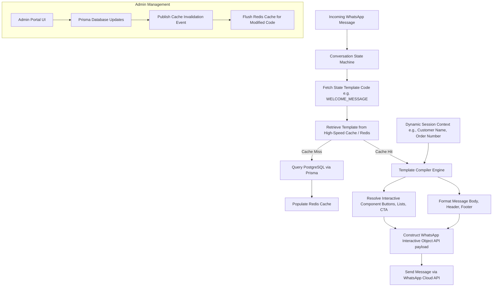

# Production-Grade Dynamic Messaging Architecture
## Sonna's Patisserie & Cafe — WhatsApp Ordering Bot

This document outlines the architectural blueprint, database schema, caching strategy, and integration guide for transitioning from hardcoded strings to a **fully database-driven, dynamic WhatsApp template management engine**. This architecture is designed like a production-grade scalable SaaS platform, allowing non-technical admins to edit any template, button, interactive list, or media resource directly from an admin panel without modifying a single line of codebase.

---

## 1. System Architecture Overview

The system transitions from hardcoded handler strings to a dynamic metadata-driven compilation flow:



---

## 2. All Required Database Tables & Prisma Schema Design

To handle rich formatting, multi-language support, versioning, audit logging, and dynamic button lists, we propose a modular, relational database structure.

### 2.1 Prisma Schema Definition

Below is the production-ready Prisma schema definition. This should be added to [schema.prisma](file:///c:/SONNAS_PATISSERIE_CAFE/prisma/schema.prisma).

```prisma
// ==========================================
// WhatsApp Dynamic Template Engine Models
// ==========================================

model WhatsAppTemplate {
  id              String                  @id @default(cuid())
  code            String                  // e.g. "WELCOME_MESSAGE", "CART_EMPTY", "SIZE_SELECTION"
  language        String                  @default("en") // e.g. "en", "hi", "mr"
  description     String?                 // Administrative context on when this triggers
  category        TemplateCategory        @default(GENERAL)
  isActive        Boolean                 @default(true)
  activeVersionId String?                 @unique // Links directly to the current published version
  createdAt       DateTime                @default(now())
  updatedAt       DateTime                @updatedAt

  versions        WhatsAppTemplateVersion[] @relation("TemplateToVersions")
  activeVersion   WhatsAppTemplateVersion?  @relation("ActiveVersion", fields: [activeVersionId], references: [id], onDelete: SetNull)

  @@unique([code, language])
  @@index([code])
  @@index([isActive])
}

model WhatsAppTemplateVersion {
  id             String                    @id @default(cuid())
  templateId     String
  versionNumber  Int                       @default(1)
  
  // Text Content (Supports WhatsApp rich Markdown and handlebar variables)
  bodyText       String                    @db.Text
  headerText     String?                   @db.Text
  footerText     String?                   @db.Text
  
  // Media Resources
  mediaUrl       String?                   // For dynamic images, product PDFs, or instructional videos
  mediaType      WhatsAppMediaType?        // IMAGE, VIDEO, DOCUMENT, NONE
  
  // Interactive Type
  interactiveType WhatsAppInteractiveType  @default(NONE) // NONE, BUTTONS, LIST, CTA_URL
  
  // Interactive Controls
  ctaButtonTitle String?                   // e.g. "Pay Now"
  ctaButtonUrl   String?                   // e.g. "{{payment_link}}"
  listButtonTitle String?                  // Title of list dropdown (e.g. "Select Cake")
  listTitle      String?                   // Overall interactive list title

  // Auditing & Rollback
  changeLog      String?                   // Description of changes made in this version
  createdBy      String?                   // Admin username/id who created this version
  createdAt      DateTime                  @default(now())

  template       WhatsAppTemplate          @relation("TemplateToVersions", fields: [templateId], references: [id], onDelete: Cascade)
  buttons        WhatsAppButton[]          // Static/dynamic button configurations
  listSections   WhatsAppListSection[]     // Static/dynamic list structures
  activeFor      WhatsAppTemplate?         @relation("ActiveVersion")

  @@unique([templateId, versionNumber])
  @@index([templateId])
}

model WhatsAppButton {
  id          String                  @id @default(cuid())
  versionId   String
  sortOrder   Int                     @default(0)
  buttonId    String                  // e.g. "btn_menu", "btn_confirm", "btn_custom"
  title       String                  // Max 20 chars (WhatsApp strict limit). Supports templates like "Pay {{price}}"
  
  version     WhatsAppTemplateVersion @relation(fields: [versionId], references: [id], onDelete: Cascade)

  @@index([versionId])
}

model WhatsAppListSection {
  id          String                  @id @default(cuid())
  versionId   String
  sortOrder   Int                     @default(0)
  title       String                  // Max 24 chars. (e.g. "⭐ Top Favorites")
  
  // Dynamic Integration field
  dataSource  SectionDataSource       @default(STATIC) // STATIC, CATEGORIES, PRODUCT_LIST, CURRENT_CART, ACTIVE_ORDERS
  
  rows        WhatsAppListRow[]
  version     WhatsAppTemplateVersion @relation(fields: [versionId], references: [id], onDelete: Cascade)

  @@index([versionId])
}

model WhatsAppListRow {
  id          String                  @id @default(cuid())
  sectionId   String
  sortOrder   Int                     @default(0)
  rowId       String                  // e.g. "cake_{{cake_id}}", "cat_{{category_id}}", "btn_status"
  title       String                  // Max 24 chars. Supports placeholders.
  description String?                 // Max 72 chars. Supports placeholders.

  section     WhatsAppListSection     @relation(fields: [sectionId], references: [id], onDelete: Cascade)

  @@index([sectionId])
}

// ==========================================
// Enums
// ==========================================

enum TemplateCategory {
  GREETING
  MENU
  CATEGORY
  PRODUCT
  ORDER
  PAYMENT
  DELIVERY
  ERROR
  GENERAL
}

enum WhatsAppMediaType {
  IMAGE
  VIDEO
  DOCUMENT
  NONE
}

enum WhatsAppInteractiveType {
  NONE
  BUTTONS
  LIST
  CTA_URL
}

enum SectionDataSource {
  STATIC            // Uses configured WhatsAppListRows explicitly
  CATEGORIES        // Dynamically populates sections with all categories from the Category model
  PRODUCT_LIST      // Dynamically populates items for a chosen category slug
  CURRENT_CART      // Dynamically populates rows with products currently in user's cart
  ACTIVE_ORDERS     // Dynamically populates rows with the user's active/completed orders
}
```

### 2.2 Table Relationships Diagram

```
+--------------------------+           +---------------------------------+
|     WhatsAppTemplate     |           |     WhatsAppTemplateVersion     |
| ------------------------ |           | ------------------------------- |
| id (PK)                  | 1       * | id (PK)                         |
| code (Unique key)        |-----------| templateId (FK)                 |
| language                 |           | versionNumber                   |
| category                 |           | bodyText, headerText, footerText|
| activeVersionId (FK) ----|-----------| mediaUrl, mediaType, etc.       |
+--------------------------+ [Active]  +---------------------------------+
                                           |      |
                    +----------------------+      +----------------------+
                    | *                                                  | *
         +--------------------+                               +-------------------------+
         |   WhatsAppButton   |                               |   WhatsAppListSection   |
         | ------------------ |                               | ----------------------- |
         | id (PK)            |                               | id (PK)                 |
         | versionId (FK)     |                               | versionId (FK)          |
         | buttonId           |                               | dataSource (Enum)       |
         | title              |                               +-------------------------+
         +--------------------+                                            | 1
                                                                           |
                                                                           | *
                                                              +-------------------------+
                                                              |     WhatsAppListRow     |
                                                              | ----------------------- |
                                                              | id (PK)                 |
                                                              | sectionId (FK)          |
                                                              | rowId, title, desc      |
                                                              +-------------------------+
```

---

## 3. Recommended Structure for Storing Message Types

This structure categorizes and models all different styles of messages required by Sonna’s Patisserie:

| Template Code | Category | Message Style | Dynamic Components / Context Variables |
| :--- | :--- | :--- | :--- |
| `WELCOME_MESSAGE` | `GREETING` | `LIST` (Dynamic Categories) | `customer_name` |
| `CATEGORY_LIST_PAGE` | `MENU` | `LIST` (Dynamic Categories) | `menu_offset`, `categories_total` |
| `CAKE_LIST_PAGE` | `MENU` | `LIST` (Dynamic Cakes) | `category_name`, `cakes_in_category` |
| `CAKE_NOT_FOUND` | `ERROR` | `BUTTONS` (Static navigation) | `input_query` |
| `SIZE_SELECTION` | `PRODUCT` | `BUTTONS` or `LIST` (Based on sizes count) | `product_name`, `options` |
| `QUANTITY_SELECTION`| `PRODUCT` | `BUTTONS` (Quick counts) | `product_name`, `selected_size` |
| `INVALID_QUANTITY` | `ERROR` | `NONE` (Simple Markdown text) | `input_value` |
| `ADDRESS_REQUEST` | `DELIVERY` | `NONE` (Interactive location request) | `customer_name` |
| `INSTRUCTION_REQUEST`| `DELIVERY` | `BUTTONS` (Skip or Back button) | `customer_name` |
| `DELIVERY_SLOT_PAGE`| `DELIVERY` | `LIST` (Dynamic time windows) | `available_dates`, `slots` |
| `ORDER_SUMMARY_CONFIRM`| `ORDER` | `BUTTONS` (Confirm, Back, Cancel) | `customer_name`, `order_summary`, `total_amount` |
| `ORDER_CONFIRMED_PAID` | `PAYMENT` | `NONE` (Simple Markdown with details) | `order_id`, `delivery_date`, `delivery_slot` |
| `ORDER_CONFIRMED_UNPAID`| `PAYMENT` | `CTA_URL` ("Pay Now" interactive button) | `order_id`, `total_amount`, `payment_link` |
| `ORDER_STATUS_HISTORY` | `ORDER` | `NONE` (Formatted list of orders) | `orders_list` |
| `GLOBAL_FALLBACK` | `ERROR` | `BUTTONS` (Restart/Menu buttons) | `error_details` |

---

## 4. Best Practices for Production

### 4.1 Rich Formatting for WhatsApp
* **Markdown Rendering:** WhatsApp supports simple markdown tags:
  * Bold: `*text*`
  * Italics: `_text_`
  * Strikethrough: `~text~`
  * Monospace: ` ```text``` `
* **Special Characters:** Emojis play a critical role in customer engagement. Ensure the PostgreSQL database supports full UTF-8 character encodings (`utf8mb4`).

### 4.2 Dynamic Placeholder Compiler Engine
Admins should write clear templates like:
> *"Hi {{customer_name}}! 🧁 Welcome to Sonna's Patisserie. Your order {{order_number}} is confirmed. Total: {{total_amount}}."*

The compiler compiles these templates at runtime. We use a high-performance regex compiler with specific sanitization rules:

```typescript
export function compileTemplate(templateStr: string, context: Record<string, any>): string {
  if (!templateStr) return "";
  return templateStr.replace(/\{\{\s*([a-zA-Z0-9_]+)\s*\}\}/g, (match, variableName) => {
    if (variableName in context) {
      const val = context[variableName];
      // Format prices if key matches currency indicators
      if (typeof val === "number" && (variableName.includes("price") || variableName.includes("amount") || variableName.includes("total"))) {
        return formatPrice(val); // Custom formatting utility helper e.g. ₹1,250
      }
      // Format Dates
      if (val instanceof Date) {
        return val.toLocaleDateString("en-IN", { day: "numeric", month: "short", year: "numeric" });
      }
      return String(val);
    }
    return ""; // Fallback: replace missing variables with empty string
  });
}
```

### 4.3 Validation Rules & Constraints
WhatsApp Cloud API imposes strict limits on payloads. The application validation layer must enforce these rules inside the database schema and on the Admin Panel:
1. **Interactive Buttons Count:** Maximum of **3 buttons** per message.
2. **Button Title length:** Strictly maximum **20 characters**.
3. **Interactive List Sections:** Maximum **10 sections**.
4. **Interactive List Rows:** Maximum **100 total rows** across all sections.
5. **List Row Title:** Strictly maximum **24 characters**.
6. **List Row Description:** Strictly maximum **72 characters**.
7. **Body Text Length:** Maximum **4,096 characters**.
8. **Footer Text Length:** Maximum **60 characters**.

### 4.4 Message Versioning & Auditing
1. **Never mutate active versions:** When an admin edits a template, a new `WhatsAppTemplateVersion` is inserted. 
2. **Incremental Version Numbers:** Automatically computed (`latestVersionNumber + 1`).
3. **Rollbacks:** Instantly revert to any past version by updating the `activeVersionId` on the main `WhatsAppTemplate` table.
4. **Audit Trail:** Maintain the creator identifier (`createdBy`) and `changeLog` fields for governance.

### 4.5 Caching Strategy (Redis & Stale-While-Revalidate)
To avoid issuing up to 10–20 SQL select statements per active WhatsApp customer interaction, we implement an aggressive, layered caching strategy:

```
[Incoming Message]
       |
       v
[Local Node Memory Cache] ---> Hit? Yes -> Return Compiled Payload
       | No
       v
[Distributed Redis Cache] ---> Hit? Yes -> Seed Node Memory & Return
       | No
       v
[PostgreSQL Database]    ---> Fetch, Seed Redis Cache (TTL: 1 hour) & Return
```

* **Cache Key Structure:** `whatsapp:template:<language>:<template_code>`
* **Cache Invalidation:** In the admin portal, saving or publishing a version triggers:
  1. An update to the database.
  2. A Redis `DEL whatsapp:template:<lang>:<code_name>` command.
  3. A pub-sub broadcast event to all Node.js cluster processes to clear their local in-memory stores.

---

## 5. Production Code Integration Guide

Here is how you swap the hardcoded welcomes and orders in Sonna's bot to the dynamic template model:

### 5.1 Dynamic Welcome Message Implementation

Below is a complete refactoring example for `sendWelcome` in [menu.ts](file:///c:/SONNAS_PATISSERIE_CAFE/src/server/whatsapp/conversation-handler/menu.ts):

```typescript
import { db } from "./prisma";
import { compileTemplate } from "./compiler"; // Custom compiler helper
import { getWhatsAppTemplate } from "./template-service"; // Caching getter

export async function sendWelcome(to: string, name?: string) {
  const customerName = name ?? "there";
  
  // 1. Fetch current dynamic template (Automatically uses high-speed Redis cache under the hood)
  const template = await getWhatsAppTemplate("WELCOME_MESSAGE", "en");
  
  if (!template || !template.activeVersion) {
    // 2. Resilient Fallback to Hardcoded Text if Database is inaccessible
    await sendTextMessage(to, `Welcome to Sonna's Patisserie! 🧁\nReply *Menu* to see our cakes.`);
    return;
  }

  const activeVersion = template.activeVersion;

  // 3. Compile Context Placeholders
  const context = {
    customer_name: customerName,
  };

  const bodyText = compileTemplate(activeVersion.bodyText, context);
  const headerText = activeVersion.headerText ? compileTemplate(activeVersion.headerText, context) : undefined;
  const footerText = activeVersion.footerText ? compileTemplate(activeVersion.footerText, context) : undefined;

  // 4. Resolve Dynamic Interactive List Sections
  const resolvedSections = await Promise.all(
    activeVersion.listSections.map(async (section) => {
      // Handle fully automated DB-driven lists
      if (section.dataSource === "CATEGORIES") {
        const dbCategories = await safeGetCategories();
        return {
          title: section.title,
          rows: dbCategories.slice(0, 8).map((cat) => ({
            id: `cat_${cat.id}`,
            title: cat.name.slice(0, 24),
            description: "Freshly crafted desserts"
          }))
        };
      }

      if (section.dataSource === "TOP_FAVORITES") {
        const cakes = await safeGetCakes();
        return {
          title: section.title,
          rows: cakes.slice(0, 3).map((cake) => ({
            id: `cake_${cake.id}`,
            title: cake.name.slice(0, 24),
            description: `From ${formatPrice(cake.options?.[0]?.price ?? 75000)}`
          }))
        };
      }

      // Default to static rows configured in the panel
      return {
        title: section.title,
        rows: section.rows.map((row) => ({
          id: compileTemplate(row.rowId, context),
          title: compileTemplate(row.title, context).slice(0, 24),
          description: row.description ? compileTemplate(row.description, context).slice(0, 72) : undefined
        }))
      };
    })
  );

  // 5. Send Dynamic WhatsApp List
  await sendInteractiveList(
    to,
    headerText ?? "Sonna's Patisserie",
    bodyText,
    activeVersion.listButtonTitle ?? "View Options",
    resolvedSections
  );

  // 6. Optionally Send Dynamic PDF Menu
  if (activeVersion.mediaUrl && activeVersion.mediaType === "DOCUMENT") {
    await sendDocumentMessage(
      to,
      activeVersion.mediaUrl,
      "Menu.pdf",
      footerText ?? "Our Menu"
    );
  }
}
```

---

## 6. Suggested Admin Panel Structure

To ensure non-technical managers, bakery staff, or marketing teams can easily manage these messages, the Admin Dashboard should contain a dedicated **"WhatsApp Communication Center"** module.

```
+-----------------------------------------------------------------------------------+
|  SONNA'S ADMIN DASHBOARD  |  WhatsApp Bot Communications                          |
+-----------------------------------------------------------------------------------+
|  [Dashboard]              |  Active Templates (14)       Drafts (2)    Languages  |
|  [Cake Inventory]         +-------------------------------------------------------+
|  [Orders System]          |  Code                 Category       Status   Actions |
|  * WhatsApp Messages *    |  ---------------------------------------------------  |
|  [Staff Management]       |  WELCOME_MESSAGE      GREETING       Active   [Edit]  |
|                           |  ORDER_CONFIRM_PAID   PAYMENT        Active   [Edit]  |
|                           |  SIZE_SELECTION       PRODUCT        Active   [Edit]  |
|                           +-------------------------------------------------------+
|                           |  + Create New Custom Template                         |
+---------------------------+-------------------------------------------------------+
```

### 6.1 Interactive Template Builder Interface

Clicking `[Edit]` opens a WYSIWYG side-by-side Live Preview Editor:

```
+-----------------------------------------------------------------------------------+
| EDIT: WELCOME_MESSAGE (English)                                 [Version Log (v4)]|
+-----------------------------------------------------------------------------------+
| [ Header Text ]  - e.g., Sonna's Patisserie & Cafe                                |
| [ Sonna's Patisserie ]                                                            |
|                                                                                   |
| [ Body Editor ] (Supports *Bold*, _Italic_, and emojis)                           |
| +-------------------------------------------------------------------------------+ |
| | Hi {{customer_name}}! 🌸                                                      | |
| | Welcome to Sonna's Patisserie! Our master chef has prepared some new          | |
| | luxury cakes for you today.                                                   | |
| +-------------------------------------------------------------------------------+ |
| Available variables: {{customer_name}}, {{order_id}}, {{total_amount}}           |
|                                                                                   |
| [ Media Resources ]                                                               |
| Type: [ Image ]  URL: [ https://qwqsarpzcwwpgyimhxzn.supabase.co/welcome.png    ] |
|                                                                                   |
| [ Interactive Components ]                                                        |
| Type: [ Dropdown List ]  Dropdown Button Label: [ View Cakes ]                    |
|                                                                                   |
| Section 1: [ ⭐ Top Favorites ]   Data Source: [ TOP_FAVORITES  v ]               |
| Section 2: [ 📋 Cake Categories ] Data Source: [ CATEGORIES     v ]               |
| Section 3: [ 🎨 Other Services ]  Data Source: [ STATIC         v ]               |
|   - Row 1: ID [ btn_custom ] Title [ Custom Cake   ] Desc [ Design your cake  ]   |
|   - Row 2: ID [ btn_status ] Title [ Track Orders  ] Desc [ View order status ]   |
|                                                                                   |
| +-------------------------------------------------------------------------------+ |
| | Change Log Note: [ Updated welcome note with new seasonal chef's details.   ] | |
| +-------------------------------------------------------------------------------+ |
|                                             [ Cancel ]  [ Save Draft ]  [ PUBLISH]|
+-----------------------------------------------------------------------------------+
```

### 6.2 Admin Control Features
1. **Live Preview Panel:** A simulated mobile phone frame on the right side of the screen that renders the WhatsApp message exactly as it will appear (including emoji rendering and resolved sample variables) in real-time.
2. **Strict Limit Validations:** Form fields must enforce length constraints:
   * Red warning text when a button name exceeds 20 characters.
   * Soft limits for message text to avoid clipping.
3. **Safety Checklist:** Before publishing, run automated tests:
   * Verify all tags like `{{var}}` match safe supported variables list.
   * Verify all URLs start with `https://` (WhatsApp requirements).
   * Check image files are in approved dimensions.

---

## 7. Example Records for Seed File

Here are sample Postgres insertions to seed this database with fully optimized dynamic records. Admins can customize these instantly.

```sql
-- 1. Insert Welcome Message Template
INSERT INTO "WhatsAppTemplate" ("id", "code", "language", "description", "category", "isActive", "createdAt", "updatedAt") 
VALUES ('t_welcome', 'WELCOME_MESSAGE', 'en', 'Initial greeting sent when user interactions start.', 'GREETING', true, NOW(), NOW());

-- 2. Insert Welcome Template Version
INSERT INTO "WhatsAppTemplateVersion" ("id", "templateId", "versionNumber", "bodyText", "headerText", "footerText", "mediaUrl", "mediaType", "interactiveType", "listButtonTitle", "listTitle", "changeLog", "createdBy", "createdAt") 
VALUES (
  'v_welcome_1', 
  't_welcome', 
  1, 
  'Hi {{customer_name}}! ✨\n\nWelcome to *Sonna''s Patisserie*\n_Where every dessert is a handcrafted masterpiece._\n\nHow can we delight you today? 🌸\n\n💡 *Quick Tips:*\n• Send *Menu* to browse all categories and items\n• Send *Status* to see order history\n• Send *Cancel* or *Restart* to clear your cart',
  'Sonna''s Patisserie',
  'Sonnas_Patisserie_Menu.pdf',
  'https://qwqsarpzcwwpgyimhxzn.supabase.co/storage/v1/object/public/cakes/menu_compressed.pdf',
  'DOCUMENT',
  'LIST',
  'View Menu',
  'Explore Patisserie',
  'Initial seeding of system',
  'System Migration',
  NOW()
);

-- Update Template to point to active version
UPDATE "WhatsAppTemplate" SET "activeVersionId" = 'v_welcome_1' WHERE "id" = 't_welcome';

-- 3. Insert Welcome Interactive Sections
INSERT INTO "WhatsAppListSection" ("id", "versionId", "sortOrder", "title", "dataSource")
VALUES 
('s_welcome_1', 'v_welcome_1', 1, '⭐ Top Favorites', 'TOP_FAVORITES'),
('s_welcome_2', 'v_welcome_2', 2, '📋 Browse by Category', 'CATEGORIES'),
('s_welcome_3', 'v_welcome_3', 3, '✨ Other Services', 'STATIC');

-- 4. Insert Static Rows under Section 3
INSERT INTO "WhatsAppListRow" ("id", "sectionId", "sortOrder", "rowId", "title", "description")
VALUES
('r_static_1', 's_welcome_3', 1, 'btn_custom', '🎨 Custom Creation', 'Design your own cake'),
('r_static_2', 's_welcome_3', 2, 'btn_status', '📦 Track My Order', 'Check your history');

-- 5. Insert Unpaid Order Confirmation Template (with dynamic CTA Pay Link)
INSERT INTO "WhatsAppTemplate" ("id", "code", "language", "description", "category", "isActive", "createdAt", "updatedAt") 
VALUES ('t_unpaid', 'ORDER_CONFIRMED_UNPAID', 'en', 'Sent when checkout completes and Razorpay link is generated.', 'PAYMENT', true, NOW(), NOW());

INSERT INTO "WhatsAppTemplateVersion" ("id", "templateId", "versionNumber", "bodyText", "interactiveType", "ctaButtonTitle", "ctaButtonUrl", "changeLog", "createdBy", "createdAt")
VALUES (
  'v_unpaid_1',
  't_unpaid',
  1,
  '🎉 *Order #{{order_id}} Placed!*\n\n📅 *{{delivery_date}}* | 🕒 *{{delivery_slot}}*\n📍 {{delivery_address}}\n\n💳 Pay *{{total_amount}}* to confirm your order. ✅',
  'CTA_URL',
  '💳 Pay Now',
  '{{payment_link}}',
  'Initial launch template for checkout payments',
  'System Migration',
  NOW()
);

UPDATE "WhatsAppTemplate" SET "activeVersionId" = 'v_unpaid_1' WHERE "id" = 't_unpaid';
```

---

## 8. Summary of Benefits & Architecture Highlights
1. **Zero Hardcoded Text:** Marketing and support copywriters can optimize tone, emoji decorations, and call-to-actions without requesting developer deploys or triggering CI/CD pipelines.
2. **Absolute Resiliency:** Built-in default values and fallback handlers protect users from crashes if database nodes experience high latency or disconnects.
3. **High Scalability:** Double-layer local-cache + Redis bypasses database operations during state loops, guaranteeing sub-millisecond bot response assembly times.
4. **Data Integrity:** Strict limits check and validate titles, row caps, and URL schemas *before* saving to the database, ensuring zero runtime rejects from the WhatsApp Cloud API.
