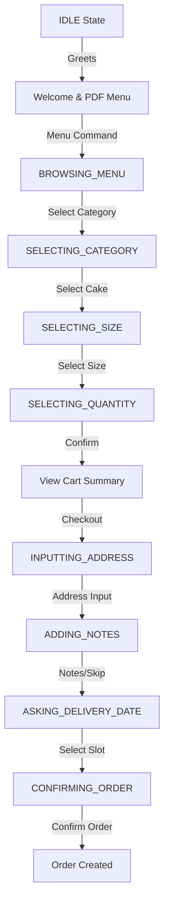
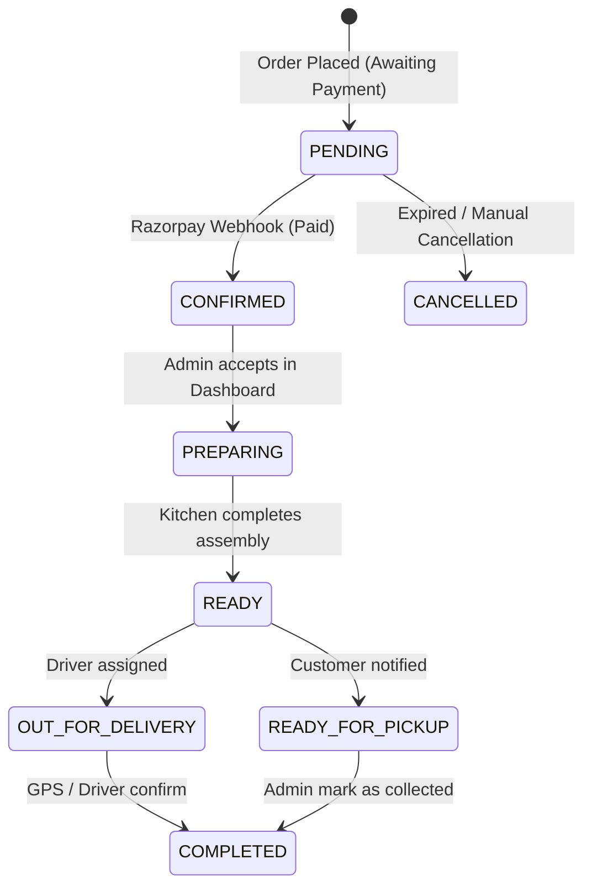

# WhatsApp Bot State Machine & UML Diagrams

The bot operates as a finite state machine (FSM). This document defines the states, transitions, and logic paths.

## 1. High-Level Conversation Flow
The user journey typically begins in the `IDLE` state and progresses through menu selection to order finalization.

## 2. Conversation States (Detailed)

| State | Description | Primary Trigger |
|---|---|---|
| `IDLE` | Default state. Awaiting first contact. | Reset command or session timeout. |
| `BROWSING_MENU` | Showing the list of main categories. | User types "Menu" or clicks "Browse Menu". |
| `SELECTING_CATEGORY` | Showing cakes within a specific category. | User clicks a category button. |
| `SELECTING_SIZE` | User must choose from available cake sizes. | User clicks a specific cake. |
| `SELECTING_QUANTITY` | User chooses how many units to add. | User selects a size. |
| `INPUTTING_ADDRESS` | Requesting delivery address or location. | User clicks "Checkout". |
| `ADDING_NOTES` | Requesting message on cake or delivery notes. | User provides address. |
| `CONFIRMING_ORDER` | Final review of items, address, and total. | User selects delivery date/slot. |
| `CUSTOM_ORDER_DETAILS` | Collecting text description for a custom cake. | User clicks "Custom Design". |
| `CUSTOM_ORDER_IMAGE` | Awaiting a reference photo for custom design. | User enters custom details. |

## 3. Order Lifecycle (Post-Bot)
Once the bot flow finishes, the order moves through internal business states.

## 4. Error & Edge Case Handling
- **`btn_back` Event**: Every state (except IDLE) supports a "Back" button which intelligently rolls back the state to the previous logical step (e.g., from `SELECTING_SIZE` back to `BROWSING_MENU`).
- **`btn_cancel` Event**: Immediately resets state to `IDLE` and clears the `WhatsAppCartItem` table for that user.
- **Image Fallback**: If an image fails to load during `SELECTING_SIZE`, the bot still delivers the size selection buttons to ensure the user isn't stuck.
