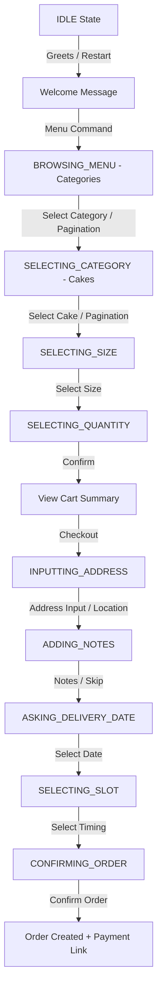
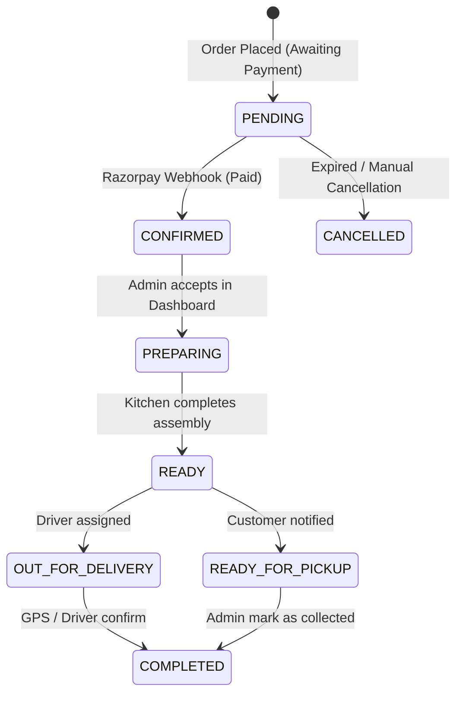

# WhatsApp Bot State Machine & Conversation Flow

The bot operates as a finite state machine (FSM). This document defines the states, transitions, and logic paths.

## 1. High-Level Conversation Flow
The user journey typically begins in the `IDLE` state and progresses through menu selection to order finalization.

## 2. Conversation States (Detailed)

| State | Description | Primary Trigger |
|---|---|---|
| `IDLE` | Default state. Awaiting first contact. | Reset command or session timeout. |
| `BROWSING_MENU` | Showing the list of main categories. Supports pagination. | User types "Menu" or clicks "Browse Menu". |
| `SELECTING_CATEGORY` | Showing cakes within a specific category. Supports pagination. | User clicks a category row (`cat_{id}`). |
| `SELECTING_SIZE` | User must choose from available cake sizes (0.5kg, 1kg, etc.). | User clicks a specific cake (`cake_{id}`). |
| `SELECTING_QUANTITY` | User chooses how many units to add (1-10). | User selects a size (`size_{idx}`). |
| `INPUTTING_ADDRESS` | Requesting delivery address or GPS location. | User clicks "Confirm Order" from cart. |
| `ADDING_NOTES` | Requesting message on cake (e.g. "Happy Birthday"). | User provides address. |
| `ASKING_DELIVERY_DATE` | Presenting delivery slot options (Date + Time). | User provides notes or skips. |
| `CONFIRMING_ORDER` | Final review of items, address, and total before DB write. | User selects delivery slot (`slot_{date}_{id}`). |
| `CUSTOM_ORDER_DETAILS` | Collecting text description for a custom cake request. | User clicks "Custom Design" in bot or website. |
| `CUSTOM_ORDER_IMAGE` | Awaiting a reference photo for custom design. | User enters custom details or types "Design my own cake". |

## 3. Special Triggers & Integrations
- **Website "Order Now"**: If a user clicks a WhatsApp link on the website like `?text=Order: Chocolate Cake`, the bot bypasses the menu and jumps directly to `SELECTING_SIZE` for that specific cake.
- **Website "Custom Design"**: Clicking the custom design link on the website triggers the `CUSTOM_ORDER_IMAGE` state immediately.
- **Pagination Logic**:
    - `more_` / `prev_`: Navigates between cake pages within a category.
    - `morecat_` / `prevcat_`: Navigates between category pages in the main menu.

## 4. Order Lifecycle (Post-Bot)
Once the bot flow finishes, the order moves through internal business states managed in the Admin Dashboard.

## 5. Error & Edge Case Handling
- **`btn_back` Event**: Every state (except IDLE) supports a "Back" button which intelligently rolls back the state to the previous logical step.
- **`btn_cancel` Event**: Immediately resets state to `IDLE` and clears the user's cart.
- **Image Fallback**: If an image fails to load during `SELECTING_SIZE`, the bot still delivers the size selection buttons to ensure the user isn't stuck.
- **Session Timeout**: Sessions reset after 60 minutes of inactivity (configurable in DB) to prevent users from being stuck in old flows.
