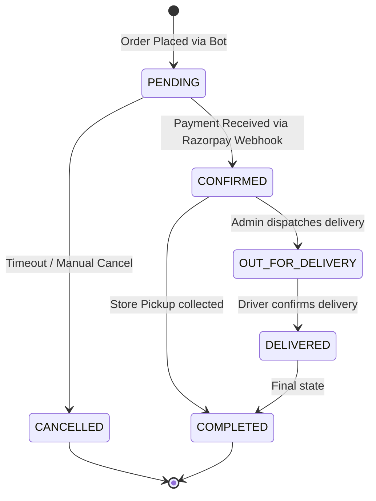
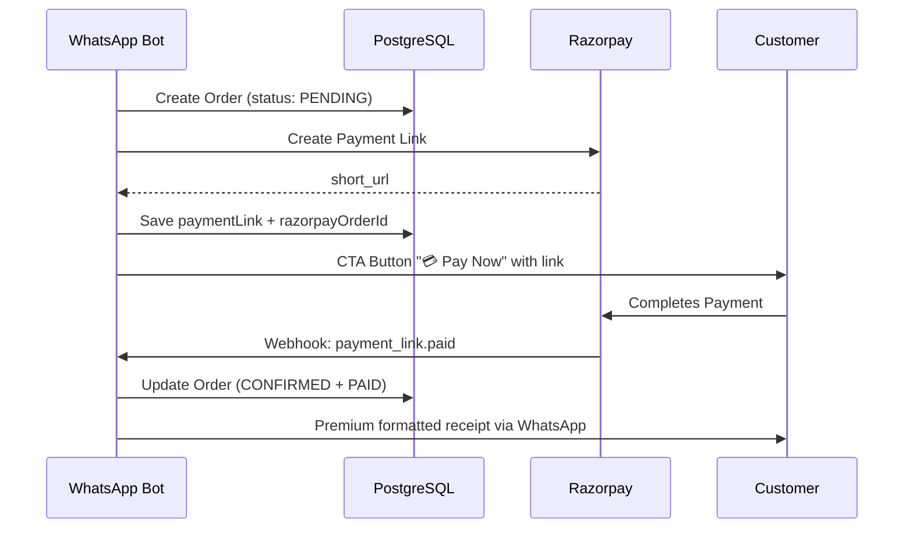

# WhatsApp Bot State Machine & Conversation Flow

The bot operates as a finite state machine (FSM). This document defines the complete states, transitions, triggers, and logic paths.

---

## 1. High-Level Conversation Flow

```mermaid
graph TD
    IDLE[IDLE State] -->|Greets / Help| WELCOME[Welcome Message + PDF]
    WELCOME -->|"Menu" / "Cakes" / btn_menu| BROWSING[BROWSING_MENU]
    BROWSING -->|cat_id / morecat_ / prevcat_| CATEGORY[SELECTING_CATEGORY]
    CATEGORY -->|cake_id / more_ / prev_| SIZE[SELECTING_SIZE]
    SIZE -->|size_idx| QTY_ADD["SELECTING_QUANTITY → Auto-Add to Cart"]
    QTY_ADD -->|Shows cart summary| CART[View Cart Summary]
    
    CART -->|btn_checkout| SAVED{Saved Address?}
    SAVED -->|Yes| REUSE[Offer Previous Address]
    SAVED -->|No| ADDRESS_CHOICE[Delivery vs Pickup]
    REUSE -->|saved_addr_yes| NOTES[ADDING_NOTES]
    REUSE -->|btn_delivery| ADDRESS_INPUT[INPUTTING_ADDRESS]
    REUSE -->|btn_pickup| NOTES
    ADDRESS_CHOICE -->|btn_delivery| ADDRESS_INPUT
    ADDRESS_CHOICE -->|btn_pickup| NOTES
    ADDRESS_INPUT -->|Text / Location| NOTES
    NOTES -->|Notes / Skip| SLOT[ASKING_DELIVERY_DATE]
    SLOT -->|slot_date_id| CONFIRM[CONFIRMING_ORDER]
    CONFIRM -->|btn_confirm| COMPLETE["Order Created + Pay Now CTA"]
    CONFIRM -->|btn_cancel / text: cancel| IDLE
    COMPLETE --> IDLE
    
    IDLE -->|btn_custom| CUSTOM_D[CUSTOM_ORDER_DETAILS]
    IDLE -->|"design my own cake"| CUSTOM_I[CUSTOM_ORDER_IMAGE]
    CUSTOM_D -->|Text description| CUSTOM_I
    CUSTOM_D -->|Image sent| COMPLETE2["Custom Order Created + Reference #"]
    CUSTOM_I -->|Image sent| COMPLETE2
    COMPLETE2 --> IDLE
    
    CART -->|btn_menu| BROWSING
    CART -->|btn_remove_last| CART
    CART -->|btn_clear_cart| BROWSING

    IDLE -->|"status" / btn_status| STATUS[Show Last 3 Orders]
    IDLE -->|Fuzzy text match| SIZE
```

---

## 2. Conversation States (Complete Reference)

| State | Description | Entry Triggers | Exit Triggers |
|---|---|---|---|
| `IDLE` | Default. Awaiting contact. | Reset, cancel, timeout, order placed | Greeting, "Menu", "Status", "btn_custom" |
| `BROWSING_MENU` | Category list with pagination (or direct cake list if ≤10 total cakes) | "Menu", `btn_menu`, `morecat_`, `prevcat_` | `cat_{id}` selection |
| `SELECTING_CATEGORY` | Cakes within a category, paginated | `cat_{id}`, `more_`, `prev_` | `cake_{id}` selection |
| `SELECTING_SIZE` | Cake sizes (buttons ≤2 options, list >2 options) | `cake_{id}`, fuzzy match | `size_{idx}` selection |
| `SELECTING_QUANTITY` | Auto-add item to cart (quantity defaults to 1) | `size_{idx}` | Auto-transitions to cart summary |
| `INPUTTING_ADDRESS` | Delivery address / GPS / Pickup / Saved address choice | `btn_checkout`, `btn_delivery` | Text address, location share, `btn_pickup`, `saved_addr_yes` |
| `ADDING_NOTES` | Cake message personalization | Address provided, `btn_pickup`, `saved_addr_yes` | Text notes or "Skip" / "No" / "None" |
| `ASKING_DELIVERY_DATE` | Date + time slot selection via interactive list | Notes provided | `slot_{date}_{id}` |
| `CONFIRMING_ORDER` | Final review & confirm / cancel | Slot selected | `btn_confirm`, "yes"/"confirm", `btn_cancel`, "no"/"cancel" |
| `CUSTOM_ORDER_DETAILS` | Custom cake text description | `btn_custom` | Text (saves notes) or image (creates order immediately) |
| `CUSTOM_ORDER_IMAGE` | Reference photo upload | "design my own cake" deep-link, description provided | Image upload (creates order) |

---

## 3. Interactive ID Patterns

All user interactions via WhatsApp buttons and lists use structured ID strings:

| Pattern | Example | Handler | Description |
|---|---|---|---|
| `cake_{id}` | `cake_cm4xyz123` | `handleCakeSelection` | Select a specific cake |
| `cat_{id}` | `cat_cm4abc456` | `handleCategorySelection` | Select a category |
| `size_{idx}` | `size_0`, `size_2` | `handleSizeSelection` | Select a size option by index |
| `qty_{n}` | `qty_3` | `handleQuantitySelection` | Select quantity (manual override) |
| `more_{catId}_{offset}` | `more_cm4abc_9` | `handleCategorySelection` | Next page of cakes |
| `prev_{catId}_{offset}` | `prev_cm4abc_0` | `handleCategorySelection` | Previous page of cakes |
| `morecat_{offset}` | `morecat_9` | `sendMenu` | Next page of categories |
| `prevcat_{offset}` | `prevcat_0` | `sendMenu` | Previous page of categories |
| `slot_{date}_{slotId}` | `slot_2026-05-15_slot2` | `handleDeliverySlotSelection` | Select delivery slot |
| `saved_addr_yes` | — | State machine | Use previous delivery address |
| `btn_menu` | — | State machine | Open menu / add more items |
| `btn_custom` | — | State machine | Start custom cake flow |
| `btn_status` | — | `sendOrderStatus` | Check order history |
| `btn_back` | — | State machine | Intelligent rollback |
| `btn_checkout` | — | `handleCartActions` | Start checkout flow |
| `btn_checkout_now` | — | `handleCartActions` | Alias for checkout |
| `btn_add_to_cart` | — | `handleCartActions` | Add selection to cart |
| `btn_remove_last` | — | State machine | Remove last cart item |
| `btn_clear_cart` | — | State machine | Clear entire cart |
| `btn_delivery` | — | State machine | Choose delivery |
| `btn_pickup` | — | State machine | Choose store pickup |
| `btn_confirm` | — | `handleConfirmation` | Confirm the order |
| `btn_cancel` | — | `handleConfirmation` | Cancel the order |

---

## 4. Special Triggers & Website Deep-Links

### Direct Order from Website
If a user clicks a WhatsApp link like `?text=Hi! I'd like to order: Chocolate Cake`, the bot:
1. Extracts the cake name via regex
2. Performs fuzzy search via `findCake()`
3. Jumps directly to `SELECTING_SIZE` — bypassing menu browsing

### Custom Design from Website
If the message contains `"design my own cake"`, the bot enters `CUSTOM_ORDER_IMAGE` directly (skipping the description step).

### Image Sent Outside Flow
If a user sends an unsolicited image while not in a custom order state, the bot proactively offers:
- "🎨 Start Custom Order" button
- "📋 Browse Menu" button

### Location Sent Outside Address Input
Saved for later use (stored in session). The bot suggests replying "Menu" to start ordering.

---

## 5. Order Lifecycle (Post-Bot)

Once the bot flow finishes, the order transitions through business states managed in the Admin Dashboard:



### Payment Flow


---

## 6. Error & Edge Case Handling

| Scenario | Bot Response |
|---|---|
| Unknown text while `IDLE` | Fuzzy match cake names; if no match, show welcome |
| `SELECTING_SIZE` or `SELECTING_QUANTITY` with lost `selectedCakeId` | Auto-reset to `IDLE` (zombie state protection) |
| Session idle > configured timeout (default 60 minutes) | Clear cart, reset state, fresh welcome with timeout notice |
| Cart empty at checkout | "Your selection is empty!" → show menu |
| Image fails to load during cake display | Skip image, still show size buttons (logged silently) |
| Razorpay link generation fails | Fall back to text message with total amount |
| Database query timeout (>15s) | Use cached data or safe defaults |
| User sends >15 messages/minute | "Slow down!" message, further input blocked |
| User sends message within 150ms of last | Silently ignored (cooldown) |
| Maintenance mode enabled | Show maintenance message (all users except status checks) |
| Invalid input during `CONFIRMING_ORDER` | Re-prompt with order summary |
| Address too short (< 5 chars) | Ask for more detail |
| Greeting while mid-flow | Re-prompt current state (no reset) |
| No orders found for "status" request | Offer "Browse Our Cakes" and "Custom Creation" buttons |
| `findCake()` returns null during size selection | Reset to `IDLE`, show menu with error message |
| DB write fails during state update | Error logged, cache update preserved, bot continues |

---

## 7. Re-Prompt Logic

If a user sends a greeting while mid-flow (e.g., types "Hi" while on the size selection screen), the bot **does not reset**. Instead, it re-sends the current state's prompt:

| State | Re-Prompt Action |
|---|---|
| `BROWSING_MENU` | Re-send category menu |
| `SELECTING_CATEGORY` | Re-send category menu |
| `SELECTING_SIZE` | Re-send size buttons/list for the selected cake |
| `INPUTTING_ADDRESS` | Re-send delivery/pickup choice |
| `ADDING_NOTES` | Re-send notes prompt |
| `ASKING_DELIVERY_DATE` | Handled by state-switch (re-enters delivery slot handler) |
| `CONFIRMING_ORDER` | Re-send order summary with confirm/cancel |
| `CUSTOM_ORDER_DETAILS` | Re-send custom cake description prompt |
| `CUSTOM_ORDER_IMAGE` | Re-send reference photo request |
| Any other / unrecognized | Re-send welcome message |
