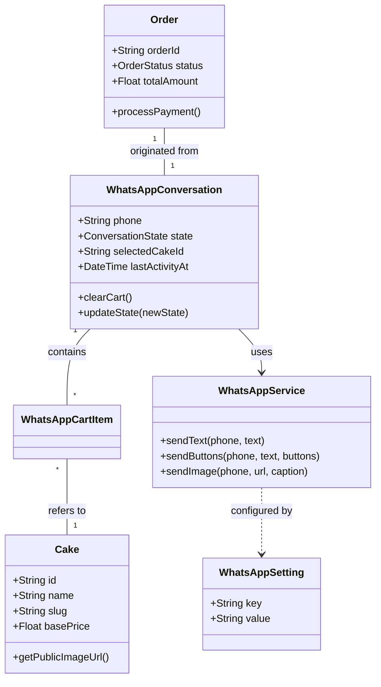
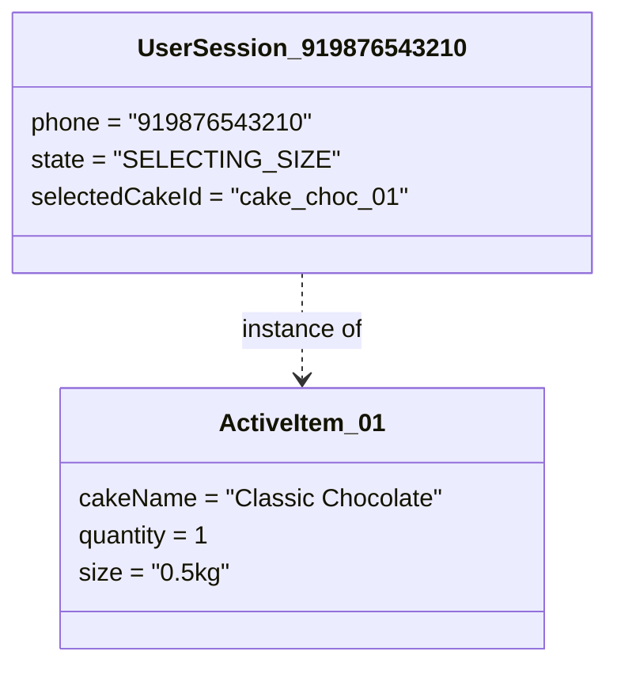
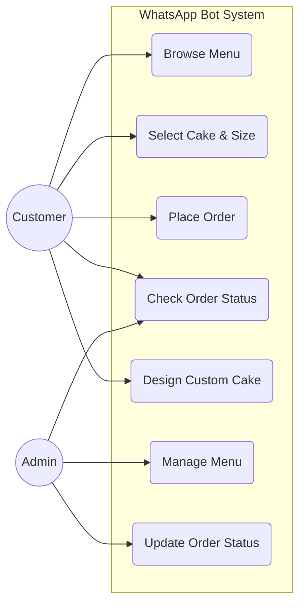
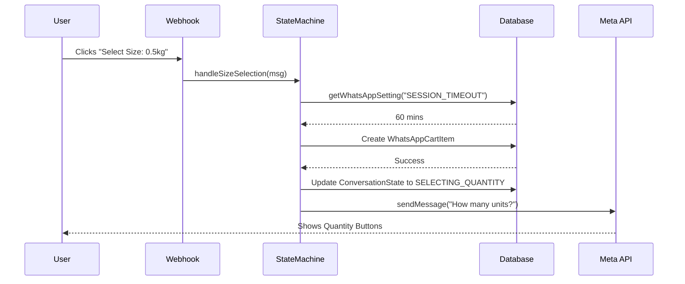
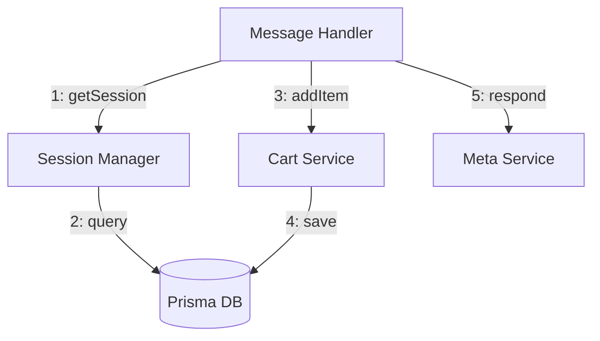
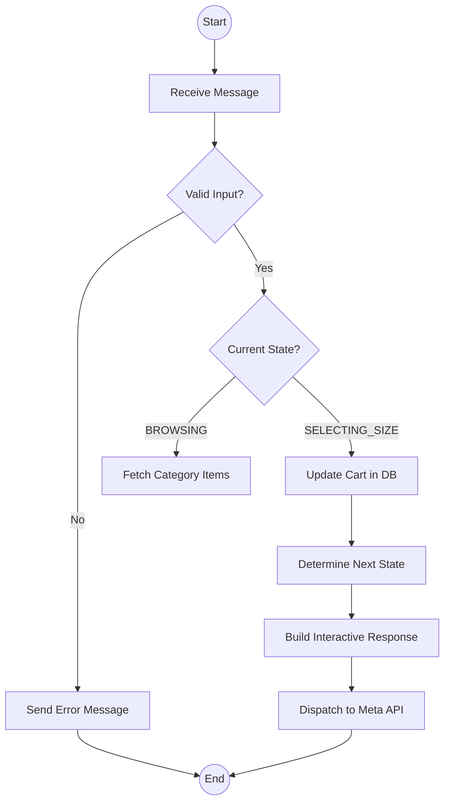
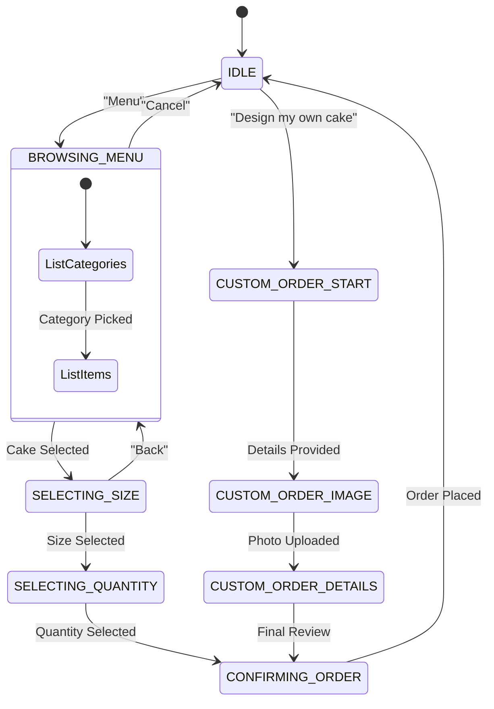
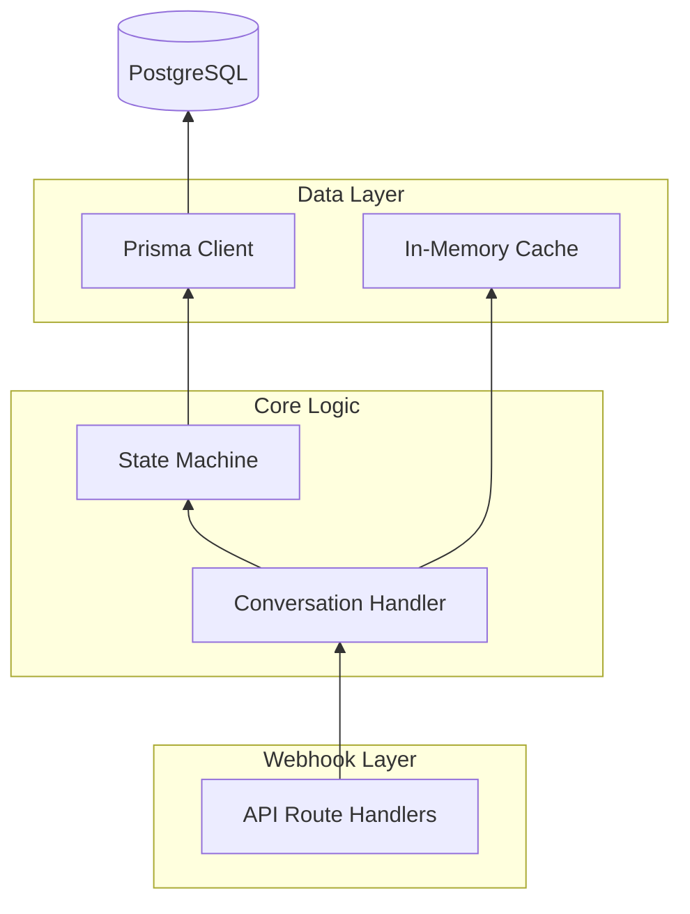
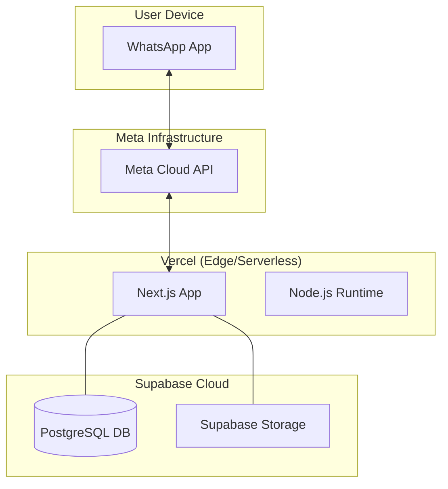

# Comprehensive UML Documentation for WhatsApp Bot

This document provides a full suite of UML diagrams describing the structural and behavioral aspects of the Sonna's Patisserie WhatsApp Bot.

---

## 1. Class Diagram (Structural)
Defines the core data models and service relationships.

---

## 2. Object Diagram (Structural)
A snapshot of a live session where a user is ordering a "Classic Chocolate" cake.

---

## 3. Use Case Diagram (Behavioral)
Models the interactions between the customer/admin and the system.

---

## 4. Sequence Diagram (Behavioral)
Detailed time-ordered flow of adding an item to the cart, including dynamic setting lookup.

---

## 5. Communication Diagram (Behavioral)
Focuses on the organization of objects involved in order creation.

---

## 6. Activity Diagram (Behavioral)
Illustrates the internal logic of the "Add to Cart" workflow.

---

## 7. State Machine Diagram (Behavioral)
The lifecycle of the User Session, including Custom Order flows.

---

## 8. Component Diagram (Structural)
High-level software components and their dependencies.

---

## 9. Deployment Diagram (Structural)
The physical nodes where the system is deployed.

