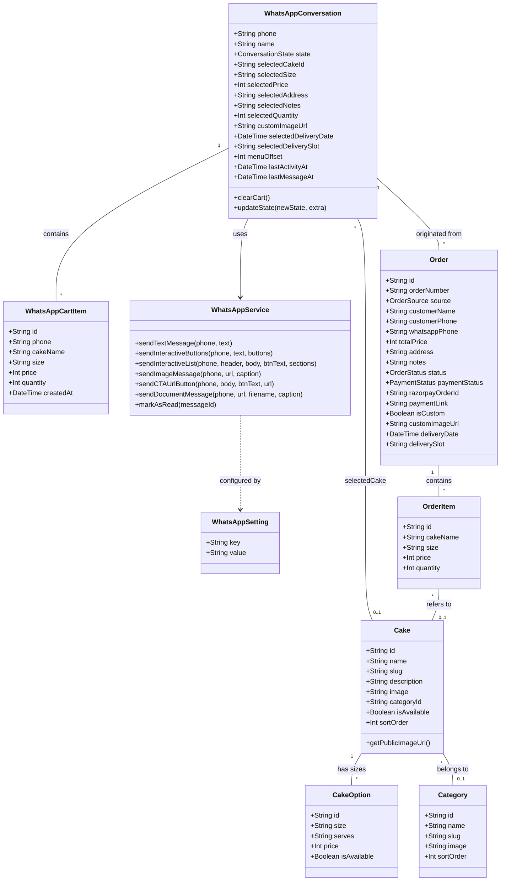
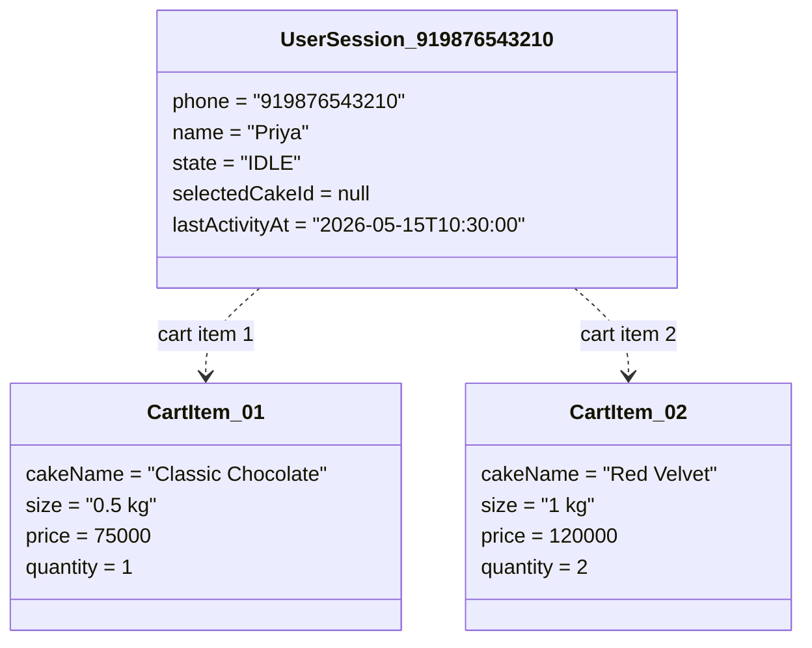
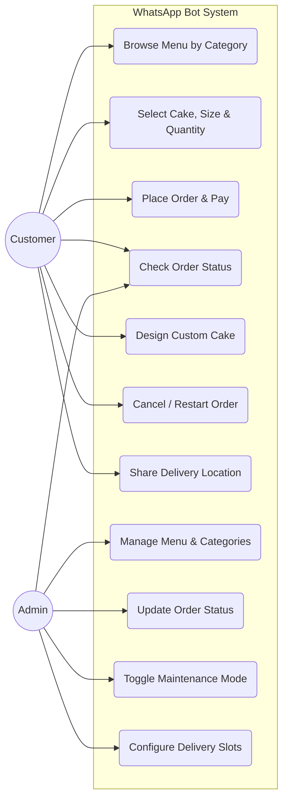
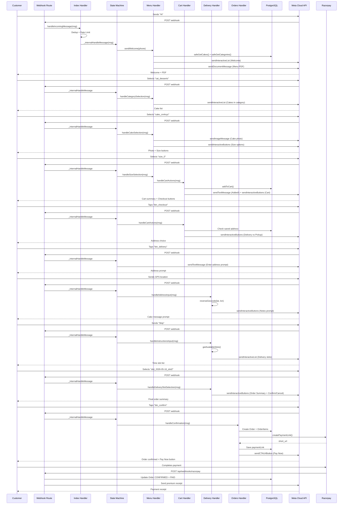
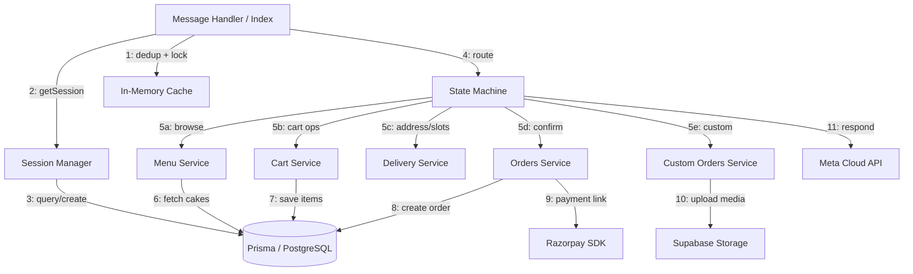
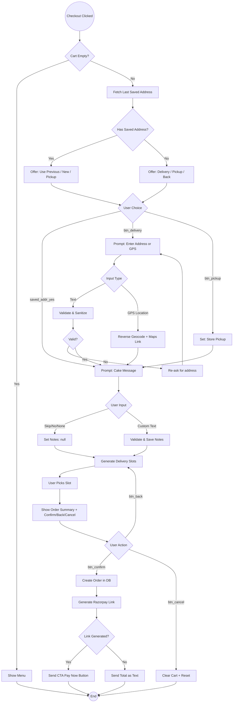
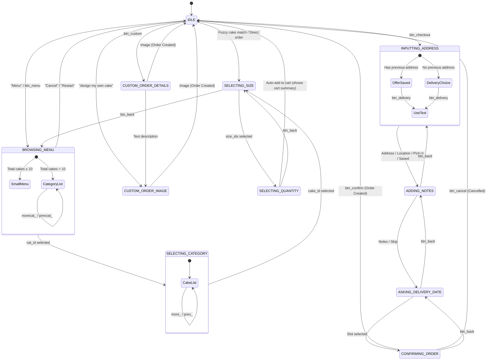
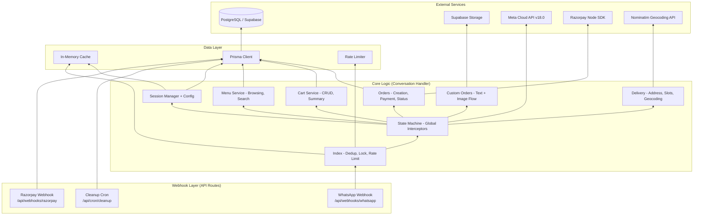
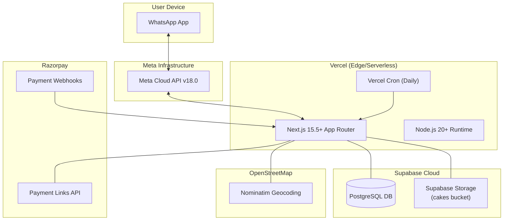

# Comprehensive UML Documentation for WhatsApp Bot

This document provides a full suite of UML diagrams describing the structural and behavioral aspects of the Sonna's Patisserie WhatsApp Bot.

---

## 1. Class Diagram (Structural)
Defines the core data models and service relationships.



---

## 2. Object Diagram (Structural)
A snapshot of a live session where a user has selected a "Classic Chocolate" cake and is viewing the cart.



---

## 3. Use Case Diagram (Behavioral)
Models the interactions between the customer/admin and the system.



---

## 4. Sequence Diagram — Complete Order Flow (Behavioral)
Detailed time-ordered flow from browsing to order confirmation.



---

## 5. Communication Diagram (Behavioral)
Focuses on the organization of objects involved in order creation.



---

## 6. Activity Diagram — Complete Checkout (Behavioral)
Illustrates the internal logic from checkout to payment.



---

## 7. State Machine Diagram (Behavioral)
The lifecycle of the User Session, including all flows.



---

## 8. Component Diagram (Structural)
High-level software components and their dependencies.



---

## 9. Deployment Diagram (Structural)
The physical nodes where the system is deployed.



---

## 10. Custom Order Flow — Activity Diagram (Behavioral)
Detailed flow for the custom cake ordering process.

```mermaid
graph TD
    Start((Start)) --> Entry{Entry Point}
    
    Entry -- "btn_custom" --> DescPrompt["Prompt: Describe your cake"]
    Entry -- '"design my own cake"' --> PhotoPrompt["Prompt: Upload Reference Photo"]
    Entry -- "Image outside flow" --> Offer["Offer: Start Custom Order?"]
    
    Offer -- "btn_custom" --> DescPrompt
    
    DescPrompt --> UserInput{User sends...}
    UserInput -- "Text" --> CheckText{Looks like address?}
    UserInput -- "Image" --> Download["Download from Meta API"]
    
    CheckText -- "No" --> SaveNotes["Save as description"]
    CheckText -- "Yes (numbers + >3 words)" --> SaveAddr["Save as address"]
    
    SaveNotes --> PhotoPrompt
    SaveAddr --> PhotoPrompt
    
    PhotoPrompt --> ImgUpload{User sends image?}
    ImgUpload -- "Yes" --> Download
    ImgUpload -- "No (text)" --> ReAsk["Re-prompt for photo"]
    
    Download --> Upload["Upload to Supabase Storage<br/>cakes/custom-requests/"]
    Upload --> Success{Upload OK?}
    Success -- "Yes" --> CreateOrder["Create Order with public URL"]
    Success -- "No" --> FallbackOrder["Create Order with whatsapp://media fallback"]
    
    CreateOrder --> Confirm["Show Reference # + Buttons"]
    FallbackOrder --> Confirm
    Confirm --> End((End))
```
